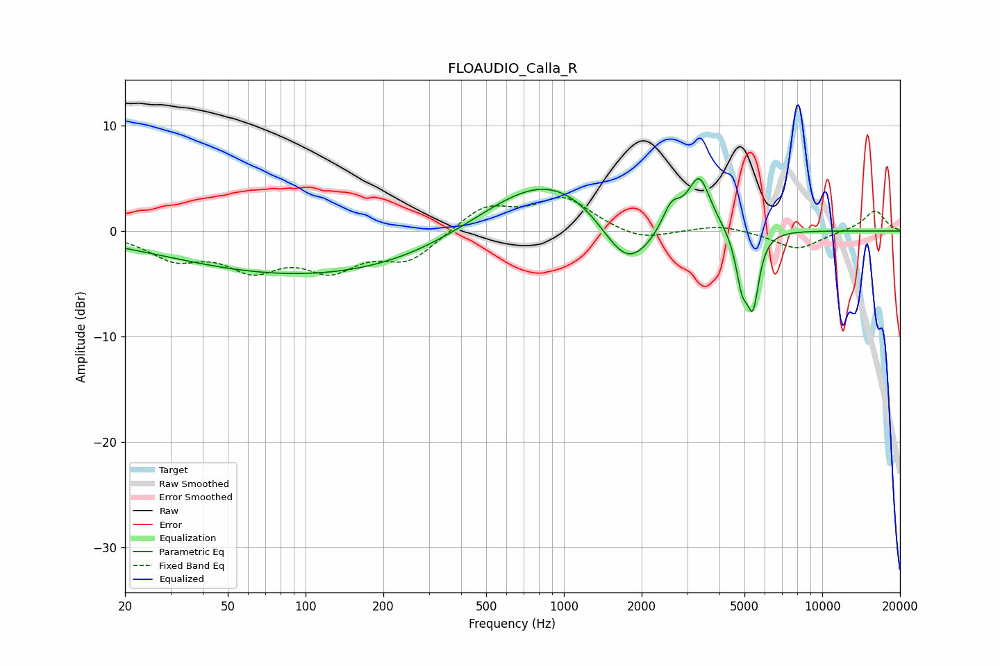

# FLOAUDIO_Calla_R
See [usage instructions](https://github.com/jaakkopasanen/AutoEq#usage) for more options and info.

### Parametric EQs
Apply preamp of -5.1 dB when using parametric equalizer.

|   # | Type    |   Fc (Hz) |    Q |   Gain (dB) |
|-----|---------|-----------|------|-------------|
|   1 | Peaking |        22 | 1.83 |        -0   |
|   2 | Peaking |        30 | 0.49 |         0.6 |
|   3 | Peaking |        92 | 0.23 |        -4.4 |
|   4 | Peaking |       295 | 0.76 |        -0.1 |
|   5 | Peaking |       882 | 0.55 |         5.8 |
|   6 | Peaking |      1759 | 1.34 |        -5.7 |
|   7 | Peaking |      2608 | 3.97 |         2.4 |
|   8 | Peaking |      3339 | 3.21 |         5   |
|   9 | Peaking |      4895 | 5.64 |        -4.6 |
|  10 | Peaking |      5399 | 6    |        -6.2 |

### Fixed Band EQs
When using fixed band (also called graphic) equalizer, apply preamp of **-3.3 dB** (if available) and set gains manually with these parameters.

|   # | Type    |   Fc (Hz) |    Q |   Gain (dB) |
|-----|---------|-----------|------|-------------|
|   1 | Peaking |        31 | 1.41 |        -2.3 |
|   2 | Peaking |        62 | 1.41 |        -3.1 |
|   3 | Peaking |       125 | 1.41 |        -3.2 |
|   4 | Peaking |       250 | 1.41 |        -2.6 |
|   5 | Peaking |       500 | 1.41 |         2.4 |
|   6 | Peaking |      1000 | 1.41 |         3   |
|   7 | Peaking |      2000 | 1.41 |        -1   |
|   8 | Peaking |      4000 | 1.41 |         0.6 |
|   9 | Peaking |      8000 | 1.41 |        -1.8 |
|  10 | Peaking |     16000 | 1.41 |         2   |

### Graphs

