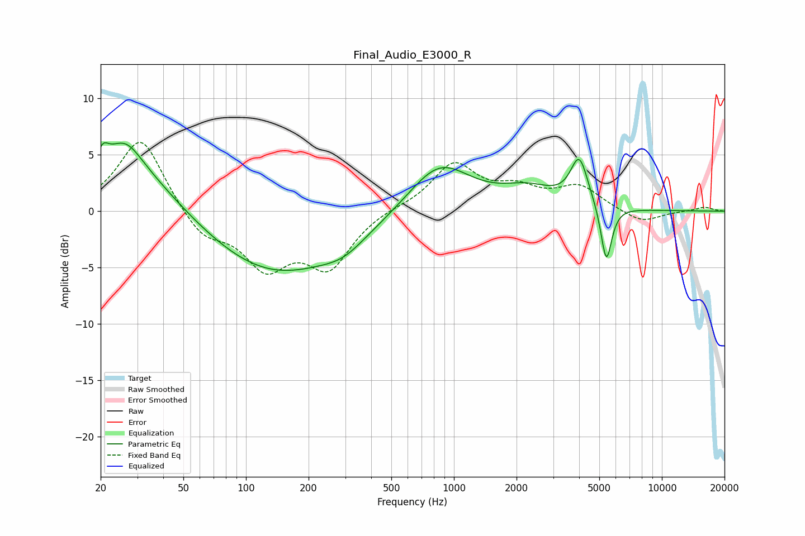

# Final_Audio_E3000_R
See [usage instructions](https://github.com/jaakkopasanen/AutoEq#usage) for more options and info.

### Parametric EQs
Apply preamp of -6.2 dB when using parametric equalizer.

|   # | Type    |   Fc (Hz) |    Q |   Gain (dB) |
|-----|---------|-----------|------|-------------|
|   1 | Peaking |        20 | 5.94 |        -2.5 |
|   2 | Peaking |        20 | 5.76 |         3.4 |
|   3 | Peaking |        25 | 0.59 |         5.2 |
|   4 | Peaking |        26 | 2.02 |         1.8 |
|   5 | Peaking |       137 | 0.41 |        -5.7 |
|   6 | Peaking |       295 | 1.39 |        -1.1 |
|   7 | Peaking |       849 | 0.94 |         4.4 |
|   8 | Peaking |      2290 | 1.07 |         1.7 |
|   9 | Peaking |      4006 | 3.34 |         4.2 |
|  10 | Peaking |      5405 | 5.31 |        -5.2 |

### Fixed Band EQs
When using fixed band (also called graphic) equalizer, apply preamp of **-6.2 dB** (if available) and set gains manually with these parameters.

|   # | Type    |   Fc (Hz) |    Q |   Gain (dB) |
|-----|---------|-----------|------|-------------|
|   1 | Peaking |        31 | 1.41 |         6.7 |
|   2 | Peaking |        62 | 1.41 |        -2.4 |
|   3 | Peaking |       125 | 1.41 |        -4.6 |
|   4 | Peaking |       250 | 1.41 |        -4.7 |
|   5 | Peaking |       500 | 1.41 |         0.3 |
|   6 | Peaking |      1000 | 1.41 |         4.1 |
|   7 | Peaking |      2000 | 1.41 |         1.6 |
|   8 | Peaking |      4000 | 1.41 |         2.1 |
|   9 | Peaking |      8000 | 1.41 |        -1.1 |
|  10 | Peaking |     16000 | 1.41 |         0.4 |

### Graphs

