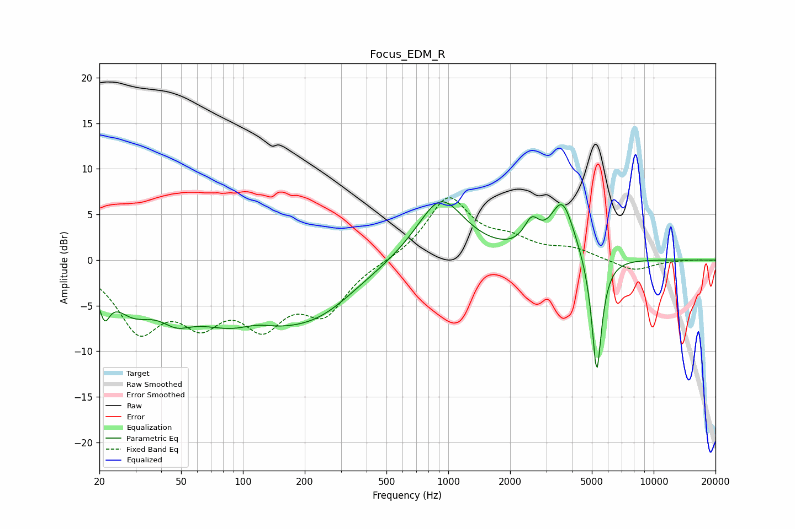

# Focus_EDM_R
See [usage instructions](https://github.com/jaakkopasanen/AutoEq#usage) for more options and info.

### Parametric EQs
Apply preamp of -6.5 dB when using parametric equalizer.

|   # | Type    |   Fc (Hz) |    Q |   Gain (dB) |
|-----|---------|-----------|------|-------------|
|   1 | Peaking |        21 | 5.46 |        -3.2 |
|   2 | Peaking |        29 | 1.45 |        -3.3 |
|   3 | Peaking |        47 | 1.96 |        -1.8 |
|   4 | Peaking |       103 | 0.45 |        -7.4 |
|   5 | Peaking |       116 | 1.57 |         1.2 |
|   6 | Peaking |       244 | 0.84 |        -2.4 |
|   7 | Peaking |       918 | 1.19 |         7   |
|   8 | Peaking |      2545 | 3.81 |         2.6 |
|   9 | Peaking |      3597 | 2.38 |         6.2 |
|  10 | Peaking |      5282 | 5.65 |       -13.4 |

### Fixed Band EQs
When using fixed band (also called graphic) equalizer, apply preamp of **-6.9 dB** (if available) and set gains manually with these parameters.

|   # | Type    |   Fc (Hz) |    Q |   Gain (dB) |
|-----|---------|-----------|------|-------------|
|   1 | Peaking |        31 | 1.41 |        -7.1 |
|   2 | Peaking |        62 | 1.41 |        -5.3 |
|   3 | Peaking |       125 | 1.41 |        -6   |
|   4 | Peaking |       250 | 1.41 |        -5.2 |
|   5 | Peaking |       500 | 1.41 |        -0.1 |
|   6 | Peaking |      1000 | 1.41 |         6.8 |
|   7 | Peaking |      2000 | 1.41 |         1.7 |
|   8 | Peaking |      4000 | 1.41 |         1.1 |
|   9 | Peaking |      8000 | 1.41 |        -1.2 |
|  10 | Peaking |     16000 | 1.41 |         0.1 |

### Graphs

