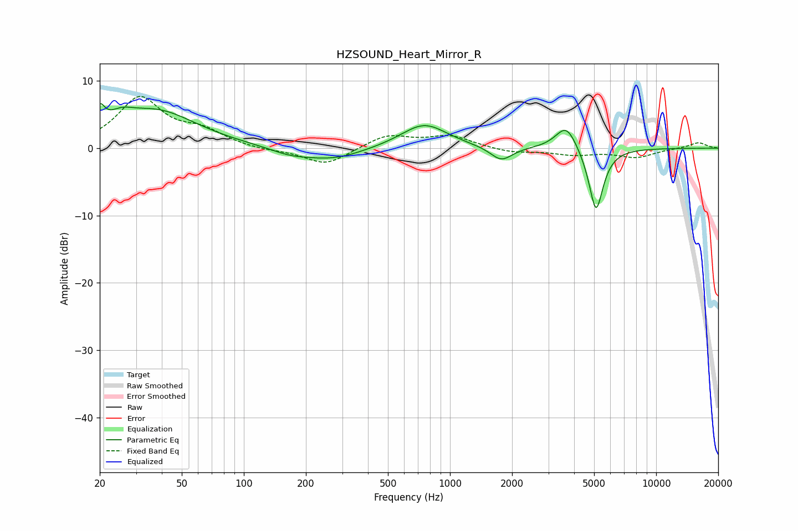

# HZSOUND_Heart_Mirror_R
See [usage instructions](https://github.com/jaakkopasanen/AutoEq#usage) for more options and info.

### Parametric EQs
Apply preamp of -6.7 dB when using parametric equalizer.

|   # | Type    |   Fc (Hz) |    Q |   Gain (dB) |
|-----|---------|-----------|------|-------------|
|   1 | Peaking |        20 | 5.99 |         3   |
|   2 | Peaking |        25 | 2.37 |         1.7 |
|   3 | Peaking |        37 | 0.72 |         5.4 |
|   4 | Peaking |       167 | 1.48 |        -0.8 |
|   5 | Peaking |       269 | 0.97 |        -1.7 |
|   6 | Peaking |       664 | 1.13 |         0.3 |
|   7 | Peaking |       755 | 1.29 |         3.4 |
|   8 | Peaking |      1774 | 2.64 |        -2.1 |
|   9 | Peaking |      3669 | 2.71 |         3.8 |
|  10 | Peaking |      5109 | 3.96 |        -9.6 |

### Fixed Band EQs
When using fixed band (also called graphic) equalizer, apply preamp of **-7.8 dB** (if available) and set gains manually with these parameters.

|   # | Type    |   Fc (Hz) |    Q |   Gain (dB) |
|-----|---------|-----------|------|-------------|
|   1 | Peaking |        31 | 1.41 |         7.3 |
|   2 | Peaking |        62 | 1.41 |         2.2 |
|   3 | Peaking |       125 | 1.41 |        -0.4 |
|   4 | Peaking |       250 | 1.41 |        -2.5 |
|   5 | Peaking |       500 | 1.41 |         2   |
|   6 | Peaking |      1000 | 1.41 |         1.7 |
|   7 | Peaking |      2000 | 1.41 |        -0.7 |
|   8 | Peaking |      4000 | 1.41 |        -0.9 |
|   9 | Peaking |      8000 | 1.41 |        -1.3 |
|  10 | Peaking |     16000 | 1.41 |         0.9 |

### Graphs

