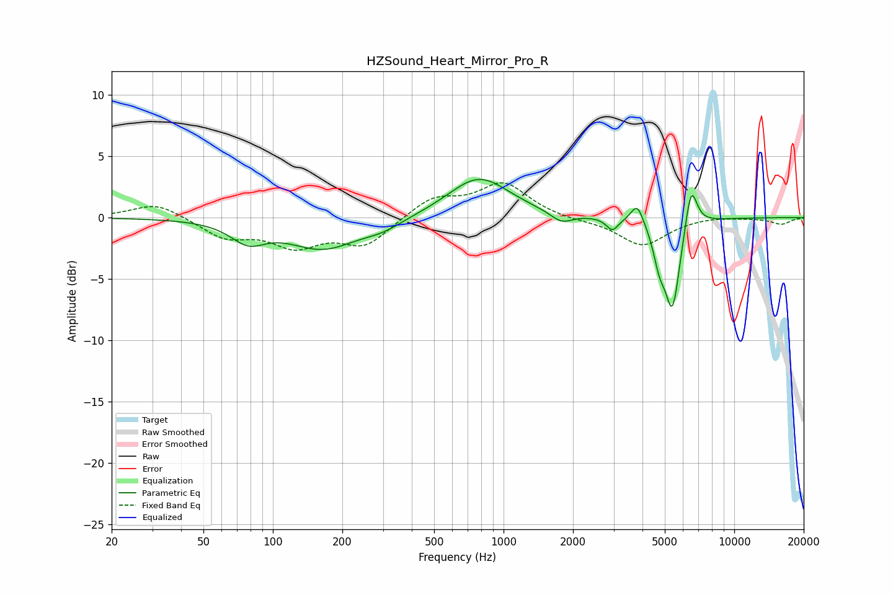

# HZSound_Heart_Mirror_Pro_R
See [usage instructions](https://github.com/jaakkopasanen/AutoEq#usage) for more options and info.

### Parametric EQs
Apply preamp of -3.2 dB when using parametric equalizer.

|   # | Type    |   Fc (Hz) |    Q |   Gain (dB) |
|-----|---------|-----------|------|-------------|
|   1 | Peaking |        78 | 1.89 |        -1.6 |
|   2 | Peaking |       165 | 0.95 |        -2.4 |
|   3 | Peaking |       300 | 1.58 |        -0.7 |
|   4 | Peaking |       782 | 1.07 |         3.3 |
|   5 | Peaking |      1782 | 2.94 |        -0.9 |
|   6 | Peaking |      2963 | 5.48 |        -1   |
|   7 | Peaking |      3799 | 5.19 |         1.7 |
|   8 | Peaking |      4734 | 5.42 |        -2.3 |
|   9 | Peaking |      5397 | 4.13 |        -7.3 |
|  10 | Peaking |      6500 | 5.28 |         3.7 |

### Fixed Band EQs
When using fixed band (also called graphic) equalizer, apply preamp of **-2.9 dB** (if available) and set gains manually with these parameters.

|   # | Type    |   Fc (Hz) |    Q |   Gain (dB) |
|-----|---------|-----------|------|-------------|
|   1 | Peaking |        31 | 1.41 |         1.2 |
|   2 | Peaking |        62 | 1.41 |        -1.5 |
|   3 | Peaking |       125 | 1.41 |        -2.1 |
|   4 | Peaking |       250 | 1.41 |        -2.2 |
|   5 | Peaking |       500 | 1.41 |         1.6 |
|   6 | Peaking |      1000 | 1.41 |         2.7 |
|   7 | Peaking |      2000 | 1.41 |        -0.2 |
|   8 | Peaking |      4000 | 1.41 |        -2.3 |
|   9 | Peaking |      8000 | 1.41 |         0.1 |
|  10 | Peaking |     16000 | 1.41 |        -0.5 |

### Graphs

