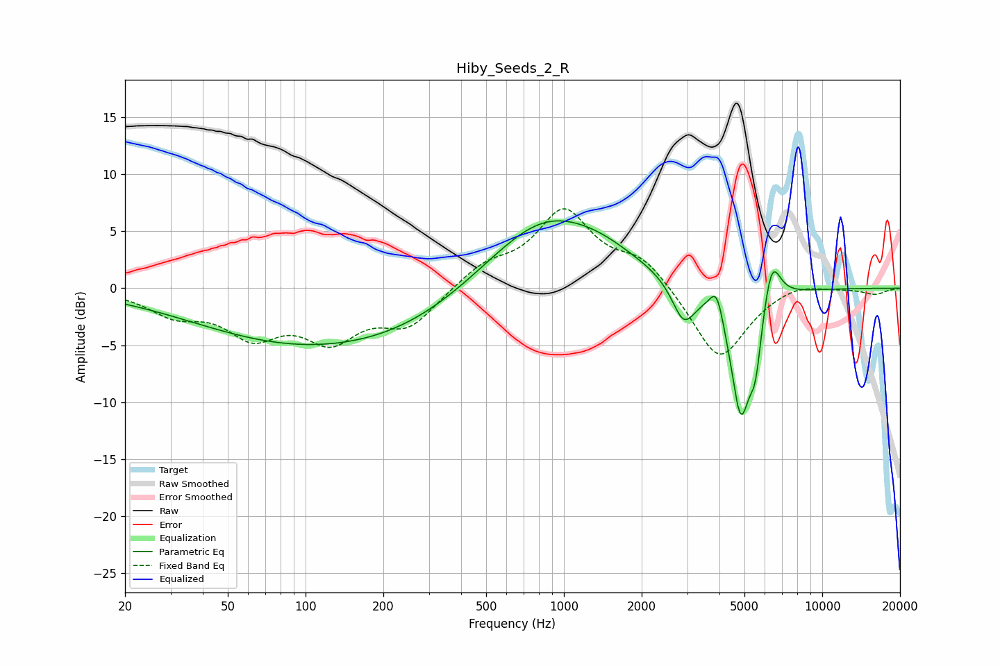

# Hiby_Seeds_2_R
See [usage instructions](https://github.com/jaakkopasanen/AutoEq#usage) for more options and info.

### Parametric EQs
Apply preamp of -6.0 dB when using parametric equalizer.

|   # | Type    |   Fc (Hz) |    Q |   Gain (dB) |
|-----|---------|-----------|------|-------------|
|   1 | Peaking |        37 | 0.62 |         0   |
|   2 | Peaking |        97 | 0.33 |        -4.7 |
|   3 | Peaking |       302 | 0.51 |        -1.6 |
|   4 | Peaking |       852 | 0.59 |         6.7 |
|   5 | Peaking |      1405 | 1.22 |         0.6 |
|   6 | Peaking |      2910 | 3.08 |        -3.6 |
|   7 | Peaking |      3903 | 5.45 |         2.6 |
|   8 | Peaking |      4837 | 3.29 |       -11.2 |
|   9 | Peaking |      5518 | 5.99 |        -4.2 |
|  10 | Peaking |      6374 | 4.06 |         4.2 |

### Fixed Band EQs
When using fixed band (also called graphic) equalizer, apply preamp of **-7.1 dB** (if available) and set gains manually with these parameters.

|   # | Type    |   Fc (Hz) |    Q |   Gain (dB) |
|-----|---------|-----------|------|-------------|
|   1 | Peaking |        31 | 1.41 |        -2   |
|   2 | Peaking |        62 | 1.41 |        -3.6 |
|   3 | Peaking |       125 | 1.41 |        -4   |
|   4 | Peaking |       250 | 1.41 |        -3.1 |
|   5 | Peaking |       500 | 1.41 |         1.8 |
|   6 | Peaking |      1000 | 1.41 |         6.6 |
|   7 | Peaking |      2000 | 1.41 |         2.5 |
|   8 | Peaking |      4000 | 1.41 |        -6.5 |
|   9 | Peaking |      8000 | 1.41 |         0.7 |
|  10 | Peaking |     16000 | 1.41 |        -0.5 |

### Graphs

