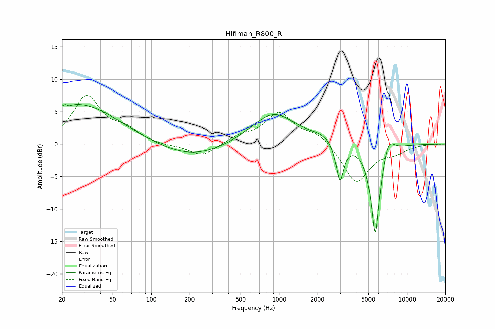

# Hifiman_R800_R
See [usage instructions](https://github.com/jaakkopasanen/AutoEq#usage) for more options and info.

### Parametric EQs
Apply preamp of -6.2 dB when using parametric equalizer.

|   # | Type    |   Fc (Hz) |    Q |   Gain (dB) |
|-----|---------|-----------|------|-------------|
|   1 | Peaking |        20 | 1.05 |         1.2 |
|   2 | Peaking |        22 | 5.98 |         2.8 |
|   3 | Peaking |        22 | 5.92 |        -2.8 |
|   4 | Peaking |        31 | 0.49 |         5.5 |
|   5 | Peaking |       208 | 0.53 |        -2.2 |
|   6 | Peaking |       902 | 0.8  |         4.9 |
|   7 | Peaking |      2171 | 1.75 |         0.8 |
|   8 | Peaking |      2990 | 4.81 |        -6   |
|   9 | Peaking |      5655 | 3.84 |       -14.4 |
|  10 | Peaking |      7157 | 3.13 |         2.7 |

### Fixed Band EQs
When using fixed band (also called graphic) equalizer, apply preamp of **-7.6 dB** (if available) and set gains manually with these parameters.

|   # | Type    |   Fc (Hz) |    Q |   Gain (dB) |
|-----|---------|-----------|------|-------------|
|   1 | Peaking |        31 | 1.41 |         7.2 |
|   2 | Peaking |        62 | 1.41 |         1.8 |
|   3 | Peaking |       125 | 1.41 |        -0.3 |
|   4 | Peaking |       250 | 1.41 |        -2   |
|   5 | Peaking |       500 | 1.41 |         1.1 |
|   6 | Peaking |      1000 | 1.41 |         4.6 |
|   7 | Peaking |      2000 | 1.41 |         1.6 |
|   8 | Peaking |      4000 | 1.41 |        -6   |
|   9 | Peaking |      8000 | 1.41 |        -1   |
|  10 | Peaking |     16000 | 1.41 |         0   |

### Graphs

