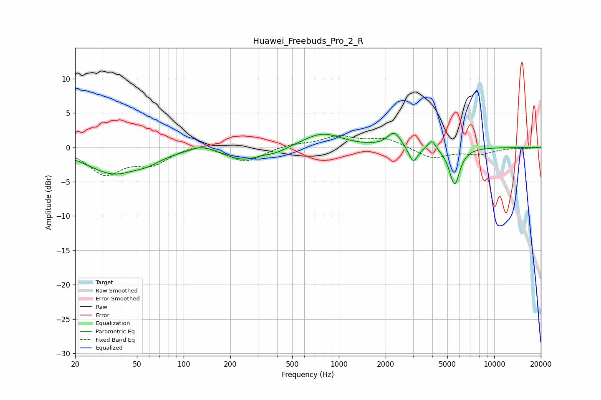

# Huawei_Freebuds_Pro_2_R
See [usage instructions](https://github.com/jaakkopasanen/AutoEq#usage) for more options and info.

### Parametric EQs
Apply preamp of -2.1 dB when using parametric equalizer.

|   # | Type    |   Fc (Hz) |    Q |   Gain (dB) |
|-----|---------|-----------|------|-------------|
|   1 | Peaking |        35 | 0.86 |        -3.7 |
|   2 | Peaking |        59 | 1.66 |        -0.9 |
|   3 | Peaking |       131 | 1.97 |         0.9 |
|   4 | Peaking |       243 | 1.25 |        -1.7 |
|   5 | Peaking |       395 | 2.01 |        -0.6 |
|   6 | Peaking |       784 | 1.16 |         2.1 |
|   7 | Peaking |      2271 | 3.31 |         2.2 |
|   8 | Peaking |      3007 | 4.81 |        -2.4 |
|   9 | Peaking |      3966 | 5.6  |         1.5 |
|  10 | Peaking |      5561 | 4.13 |        -5.4 |

### Fixed Band EQs
When using fixed band (also called graphic) equalizer, apply preamp of **-1.8 dB** (if available) and set gains manually with these parameters.

|   # | Type    |   Fc (Hz) |    Q |   Gain (dB) |
|-----|---------|-----------|------|-------------|
|   1 | Peaking |        31 | 1.41 |        -3.7 |
|   2 | Peaking |        62 | 1.41 |        -2.2 |
|   3 | Peaking |       125 | 1.41 |         0.8 |
|   4 | Peaking |       250 | 1.41 |        -2.2 |
|   5 | Peaking |       500 | 1.41 |         0.5 |
|   6 | Peaking |      1000 | 1.41 |         1.5 |
|   7 | Peaking |      2000 | 1.41 |         1.3 |
|   8 | Peaking |      4000 | 1.41 |        -1.6 |
|   9 | Peaking |      8000 | 1.41 |        -0.9 |
|  10 | Peaking |     16000 | 1.41 |        -0.1 |

### Graphs

