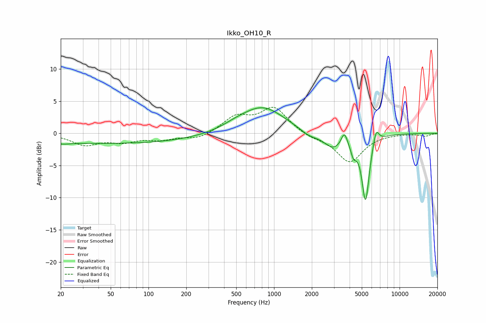

# Ikko_OH10_R
See [usage instructions](https://github.com/jaakkopasanen/AutoEq#usage) for more options and info.

### Parametric EQs
Apply preamp of -4.1 dB when using parametric equalizer.

|   # | Type    |   Fc (Hz) |    Q |   Gain (dB) |
|-----|---------|-----------|------|-------------|
|   1 | Peaking |        21 | 2.45 |        -0.3 |
|   2 | Peaking |        52 | 0.18 |        -1.6 |
|   3 | Peaking |       495 | 1.31 |         0.5 |
|   4 | Peaking |       810 | 0.82 |         4.1 |
|   5 | Peaking |      1896 | 2.03 |        -0.9 |
|   6 | Peaking |      2949 | 1.86 |        -2.3 |
|   7 | Peaking |      3630 | 5.97 |         2   |
|   8 | Peaking |      4294 | 6    |        -2   |
|   9 | Peaking |      5356 | 4.6  |       -10.3 |
|  10 | Peaking |      6491 | 5.91 |         2.4 |

### Fixed Band EQs
When using fixed band (also called graphic) equalizer, apply preamp of **-4.1 dB** (if available) and set gains manually with these parameters.

|   # | Type    |   Fc (Hz) |    Q |   Gain (dB) |
|-----|---------|-----------|------|-------------|
|   1 | Peaking |        31 | 1.41 |        -1.7 |
|   2 | Peaking |        62 | 1.41 |        -1.1 |
|   3 | Peaking |       125 | 1.41 |        -0.9 |
|   4 | Peaking |       250 | 1.41 |        -0.9 |
|   5 | Peaking |       500 | 1.41 |         2.4 |
|   6 | Peaking |      1000 | 1.41 |         3.9 |
|   7 | Peaking |      2000 | 1.41 |        -0.6 |
|   8 | Peaking |      4000 | 1.41 |        -4.4 |
|   9 | Peaking |      8000 | 1.41 |        -0   |
|  10 | Peaking |     16000 | 1.41 |        -0.4 |

### Graphs

