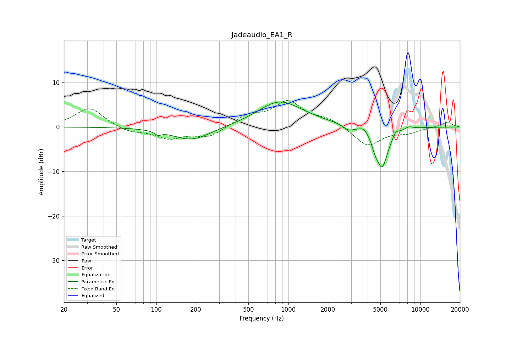

# Jadeaudio_EA1_R
See [usage instructions](https://github.com/jaakkopasanen/AutoEq#usage) for more options and info.

### Parametric EQs
Apply preamp of -5.7 dB when using parametric equalizer.

|   # | Type    |   Fc (Hz) |    Q |   Gain (dB) |
|-----|---------|-----------|------|-------------|
|   1 | Peaking |       103 | 5.98 |        -0.8 |
|   2 | Peaking |       185 | 0.98 |        -3.1 |
|   3 | Peaking |       853 | 0.86 |         5.4 |
|   4 | Peaking |      1421 | 0.62 |         0.6 |
|   5 | Peaking |      2862 | 3.58 |        -1.1 |
|   6 | Peaking |      3761 | 4.63 |         1.1 |
|   7 | Peaking |      4548 | 5.99 |        -1.6 |
|   8 | Peaking |      5146 | 2.96 |        -9   |
|   9 | Peaking |      6532 | 6    |         1.2 |
|  10 | Peaking |      8175 | 3.87 |         0.6 |

### Fixed Band EQs
When using fixed band (also called graphic) equalizer, apply preamp of **-6.0 dB** (if available) and set gains manually with these parameters.

|   # | Type    |   Fc (Hz) |    Q |   Gain (dB) |
|-----|---------|-----------|------|-------------|
|   1 | Peaking |        31 | 1.41 |         4.4 |
|   2 | Peaking |        62 | 1.41 |        -1.2 |
|   3 | Peaking |       125 | 1.41 |        -2.4 |
|   4 | Peaking |       250 | 1.41 |        -2.3 |
|   5 | Peaking |       500 | 1.41 |         2.4 |
|   6 | Peaking |      1000 | 1.41 |         5.5 |
|   7 | Peaking |      2000 | 1.41 |         1.7 |
|   8 | Peaking |      4000 | 1.41 |        -4.3 |
|   9 | Peaking |      8000 | 1.41 |        -1.2 |
|  10 | Peaking |     16000 | 1.41 |         1.1 |

### Graphs

