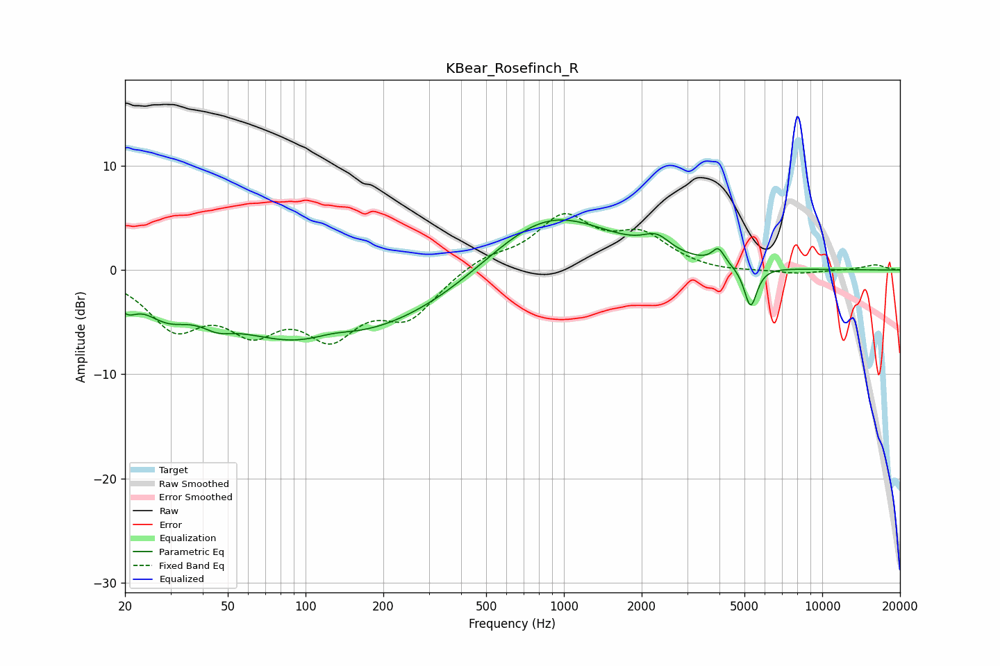

# KBear_Rosefinch_R
See [usage instructions](https://github.com/jaakkopasanen/AutoEq#usage) for more options and info.

### Parametric EQs
Apply preamp of -4.9 dB when using parametric equalizer.

|   # | Type    |   Fc (Hz) |    Q |   Gain (dB) |
|-----|---------|-----------|------|-------------|
|   1 | Peaking |        20 | 3.63 |        -1.8 |
|   2 | Peaking |        29 | 1.67 |        -2.2 |
|   3 | Peaking |        45 | 2.47 |        -1   |
|   4 | Peaking |        95 | 0.43 |        -6.3 |
|   5 | Peaking |       127 | 1.59 |         0.8 |
|   6 | Peaking |       302 | 0.51 |        -2.6 |
|   7 | Peaking |       862 | 0.58 |         6   |
|   8 | Peaking |      2286 | 2.69 |         1.5 |
|   9 | Peaking |      3962 | 5.95 |         1.5 |
|  10 | Peaking |      5281 | 5.72 |        -3.9 |

### Fixed Band EQs
When using fixed band (also called graphic) equalizer, apply preamp of **-5.5 dB** (if available) and set gains manually with these parameters.

|   # | Type    |   Fc (Hz) |    Q |   Gain (dB) |
|-----|---------|-----------|------|-------------|
|   1 | Peaking |        31 | 1.41 |        -5   |
|   2 | Peaking |        62 | 1.41 |        -4.7 |
|   3 | Peaking |       125 | 1.41 |        -5.4 |
|   4 | Peaking |       250 | 1.41 |        -4.1 |
|   5 | Peaking |       500 | 1.41 |         1.2 |
|   6 | Peaking |      1000 | 1.41 |         4.8 |
|   7 | Peaking |      2000 | 1.41 |         3   |
|   8 | Peaking |      4000 | 1.41 |        -0.3 |
|   9 | Peaking |      8000 | 1.41 |        -0.4 |
|  10 | Peaking |     16000 | 1.41 |         0.5 |

### Graphs

