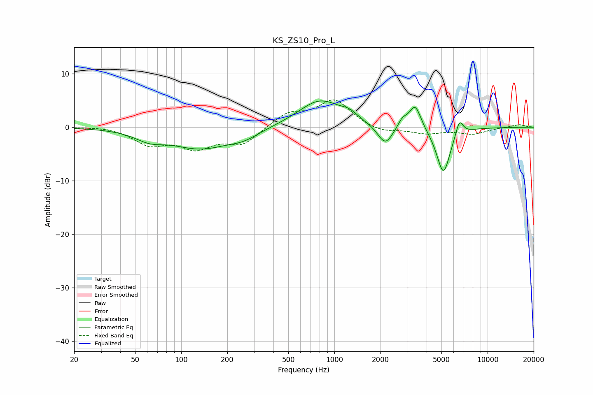

# KS_ZS10_Pro_L
See [usage instructions](https://github.com/jaakkopasanen/AutoEq#usage) for more options and info.

### Parametric EQs
Apply preamp of -5.0 dB when using parametric equalizer.

|   # | Type    |   Fc (Hz) |    Q |   Gain (dB) |
|-----|---------|-----------|------|-------------|
|   1 | Peaking |        62 | 1.48 |        -1.6 |
|   2 | Peaking |       134 | 0.74 |        -3.7 |
|   3 | Peaking |       256 | 1.39 |        -1.4 |
|   4 | Peaking |       807 | 0.99 |         5.1 |
|   5 | Peaking |      1252 | 2.69 |         1.1 |
|   6 | Peaking |      2149 | 2.8  |        -3.8 |
|   7 | Peaking |      2787 | 4.54 |         1.5 |
|   8 | Peaking |      3370 | 3.68 |         4.5 |
|   9 | Peaking |      5148 | 3.03 |        -8.8 |
|  10 | Peaking |      6546 | 5.58 |         3.1 |

### Fixed Band EQs
When using fixed band (also called graphic) equalizer, apply preamp of **-5.2 dB** (if available) and set gains manually with these parameters.

|   # | Type    |   Fc (Hz) |    Q |   Gain (dB) |
|-----|---------|-----------|------|-------------|
|   1 | Peaking |        31 | 1.41 |         0.3 |
|   2 | Peaking |        62 | 1.41 |        -3   |
|   3 | Peaking |       125 | 1.41 |        -3.5 |
|   4 | Peaking |       250 | 1.41 |        -3.1 |
|   5 | Peaking |       500 | 1.41 |         2.5 |
|   6 | Peaking |      1000 | 1.41 |         5   |
|   7 | Peaking |      2000 | 1.41 |        -1.1 |
|   8 | Peaking |      4000 | 1.41 |        -1.1 |
|   9 | Peaking |      8000 | 1.41 |        -1.2 |
|  10 | Peaking |     16000 | 1.41 |         0.5 |

### Graphs

