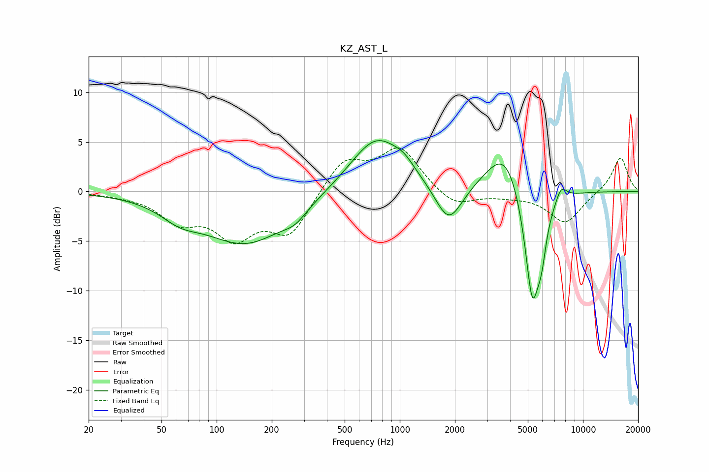

# KZ_AST_L
See [usage instructions](https://github.com/jaakkopasanen/AutoEq#usage) for more options and info.

### Parametric EQs
Apply preamp of -5.2 dB when using parametric equalizer.

|   # | Type    |   Fc (Hz) |    Q |   Gain (dB) |
|-----|---------|-----------|------|-------------|
|   1 | Peaking |        63 | 1.33 |        -1.4 |
|   2 | Peaking |       145 | 0.61 |        -5.2 |
|   3 | Peaking |       268 | 2.2  |        -1   |
|   4 | Peaking |       747 | 0.97 |         5.7 |
|   5 | Peaking |      1056 | 2.54 |         0.8 |
|   6 | Peaking |      1850 | 1.91 |        -4.1 |
|   7 | Peaking |      3775 | 1.36 |         5   |
|   8 | Peaking |      5293 | 3.08 |       -12.2 |
|   9 | Peaking |      5946 | 5.56 |        -2.9 |
|  10 | Peaking |      7604 | 4.41 |         1.5 |

### Fixed Band EQs
When using fixed band (also called graphic) equalizer, apply preamp of **-4.5 dB** (if available) and set gains manually with these parameters.

|   # | Type    |   Fc (Hz) |    Q |   Gain (dB) |
|-----|---------|-----------|------|-------------|
|   1 | Peaking |        31 | 1.41 |        -0.2 |
|   2 | Peaking |        62 | 1.41 |        -2.7 |
|   3 | Peaking |       125 | 1.41 |        -4.2 |
|   4 | Peaking |       250 | 1.41 |        -4.2 |
|   5 | Peaking |       500 | 1.41 |         3.3 |
|   6 | Peaking |      1000 | 1.41 |         4.3 |
|   7 | Peaking |      2000 | 1.41 |        -1.6 |
|   8 | Peaking |      4000 | 1.41 |        -0.3 |
|   9 | Peaking |      8000 | 1.41 |        -3.2 |
|  10 | Peaking |     16000 | 1.41 |         3.5 |

### Graphs

