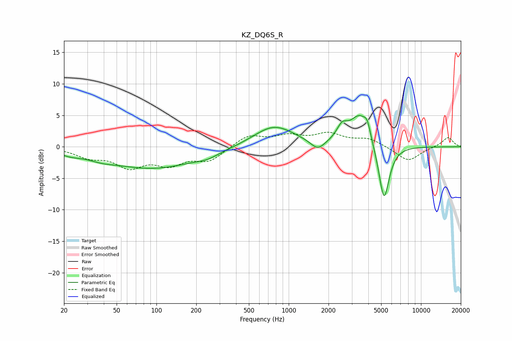

# KZ_DQ6S_R
See [usage instructions](https://github.com/jaakkopasanen/AutoEq#usage) for more options and info.

### Parametric EQs
Apply preamp of -5.1 dB when using parametric equalizer.

|   # | Type    |   Fc (Hz) |    Q |   Gain (dB) |
|-----|---------|-----------|------|-------------|
|   1 | Peaking |        22 | 1.78 |        -0.6 |
|   2 | Peaking |        38 | 1.44 |        -0.6 |
|   3 | Peaking |        94 | 0.42 |        -3.4 |
|   4 | Peaking |       242 | 1.7  |        -0.6 |
|   5 | Peaking |       774 | 0.92 |         3.4 |
|   6 | Peaking |      1658 | 2.63 |        -1.6 |
|   7 | Peaking |      2532 | 3.47 |         2.1 |
|   8 | Peaking |      3454 | 1.86 |         5   |
|   9 | Peaking |      3922 | 5.99 |         1.7 |
|  10 | Peaking |      5249 | 3.41 |        -9.3 |

### Fixed Band EQs
When using fixed band (also called graphic) equalizer, apply preamp of **-2.4 dB** (if available) and set gains manually with these parameters.

|   # | Type    |   Fc (Hz) |    Q |   Gain (dB) |
|-----|---------|-----------|------|-------------|
|   1 | Peaking |        31 | 1.41 |        -1.4 |
|   2 | Peaking |        62 | 1.41 |        -2.9 |
|   3 | Peaking |       125 | 1.41 |        -2.4 |
|   4 | Peaking |       250 | 1.41 |        -2.1 |
|   5 | Peaking |       500 | 1.41 |         1.8 |
|   6 | Peaking |      1000 | 1.41 |         1.5 |
|   7 | Peaking |      2000 | 1.41 |         1.8 |
|   8 | Peaking |      4000 | 1.41 |         1.2 |
|   9 | Peaking |      8000 | 1.41 |        -2.3 |
|  10 | Peaking |     16000 | 1.41 |         1.5 |

### Graphs

