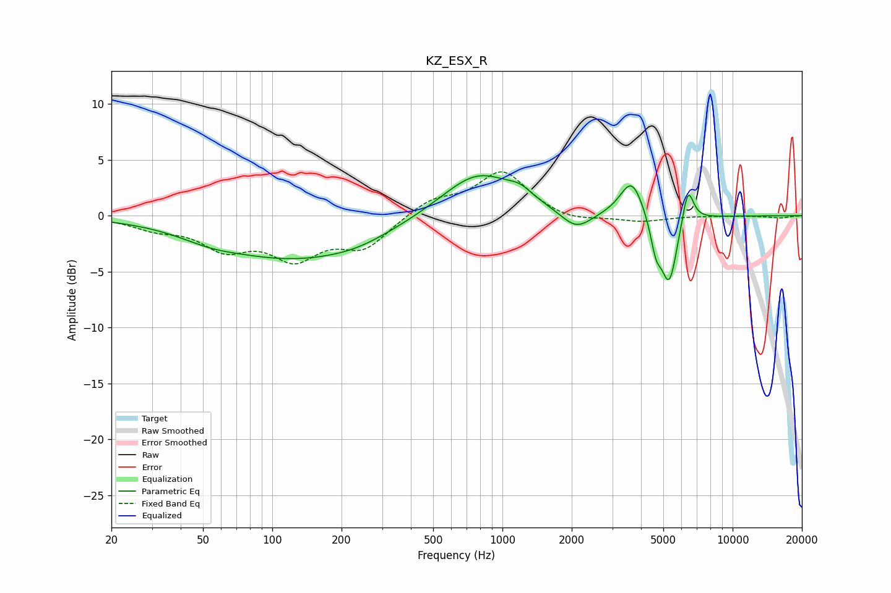

# KZ_ESX_R
See [usage instructions](https://github.com/jaakkopasanen/AutoEq#usage) for more options and info.

### Parametric EQs
Apply preamp of -3.7 dB when using parametric equalizer.

|   # | Type    |   Fc (Hz) |    Q |   Gain (dB) |
|-----|---------|-----------|------|-------------|
|   1 | Peaking |        53 | 1.12 |        -0.6 |
|   2 | Peaking |       125 | 0.42 |        -3.7 |
|   3 | Peaking |       238 | 1.05 |        -0.5 |
|   4 | Peaking |       783 | 0.89 |         4   |
|   5 | Peaking |      1193 | 2.63 |         0.8 |
|   6 | Peaking |      2094 | 2.08 |        -1.7 |
|   7 | Peaking |      3647 | 2.78 |         3.4 |
|   8 | Peaking |      4643 | 5.96 |        -2.5 |
|   9 | Peaking |      5302 | 3.87 |        -6.2 |
|  10 | Peaking |      6391 | 5.53 |         3.4 |

### Fixed Band EQs
When using fixed band (also called graphic) equalizer, apply preamp of **-4.0 dB** (if available) and set gains manually with these parameters.

|   # | Type    |   Fc (Hz) |    Q |   Gain (dB) |
|-----|---------|-----------|------|-------------|
|   1 | Peaking |        31 | 1.41 |        -1   |
|   2 | Peaking |        62 | 1.41 |        -2.6 |
|   3 | Peaking |       125 | 1.41 |        -3.4 |
|   4 | Peaking |       250 | 1.41 |        -2.7 |
|   5 | Peaking |       500 | 1.41 |         1.4 |
|   6 | Peaking |      1000 | 1.41 |         3.9 |
|   7 | Peaking |      2000 | 1.41 |        -0.6 |
|   8 | Peaking |      4000 | 1.41 |        -0.5 |
|   9 | Peaking |      8000 | 1.41 |         0   |
|  10 | Peaking |     16000 | 1.41 |        -0.2 |

### Graphs

