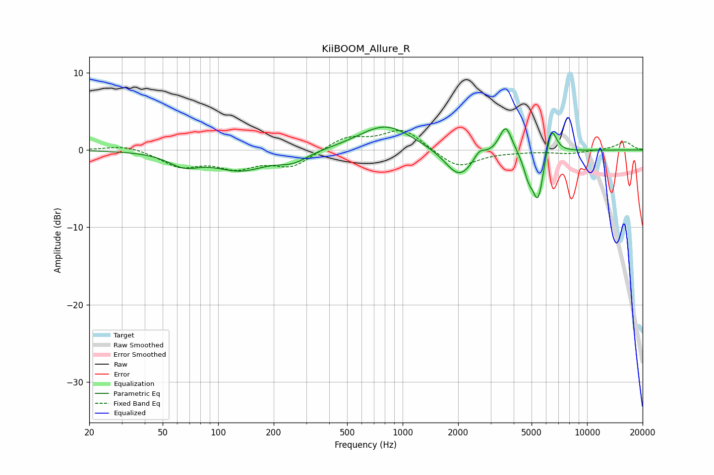

# KiiBOOM_Allure_R
See [usage instructions](https://github.com/jaakkopasanen/AutoEq#usage) for more options and info.

### Parametric EQs
Apply preamp of -3.1 dB when using parametric equalizer.

|   # | Type    |   Fc (Hz) |    Q |   Gain (dB) |
|-----|---------|-----------|------|-------------|
|   1 | Peaking |        65 | 1.71 |        -1.6 |
|   2 | Peaking |       132 | 0.97 |        -2.4 |
|   3 | Peaking |       254 | 1.76 |        -1.2 |
|   4 | Peaking |       807 | 0.98 |         3.3 |
|   5 | Peaking |      2029 | 1.83 |        -3.8 |
|   6 | Peaking |      2610 | 4.86 |         1.1 |
|   7 | Peaking |      3621 | 4.13 |         3.6 |
|   8 | Peaking |      4810 | 5.15 |        -2.4 |
|   9 | Peaking |      5427 | 4.63 |        -6.3 |
|  10 | Peaking |      6410 | 4.94 |         3.8 |

### Fixed Band EQs
When using fixed band (also called graphic) equalizer, apply preamp of **-2.6 dB** (if available) and set gains manually with these parameters.

|   # | Type    |   Fc (Hz) |    Q |   Gain (dB) |
|-----|---------|-----------|------|-------------|
|   1 | Peaking |        31 | 1.41 |         0.7 |
|   2 | Peaking |        62 | 1.41 |        -2   |
|   3 | Peaking |       125 | 1.41 |        -2   |
|   4 | Peaking |       250 | 1.41 |        -2.1 |
|   5 | Peaking |       500 | 1.41 |         1.7 |
|   6 | Peaking |      1000 | 1.41 |         2.7 |
|   7 | Peaking |      2000 | 1.41 |        -2.4 |
|   8 | Peaking |      4000 | 1.41 |        -0.1 |
|   9 | Peaking |      8000 | 1.41 |        -0.4 |
|  10 | Peaking |     16000 | 1.41 |         1.1 |

### Graphs

