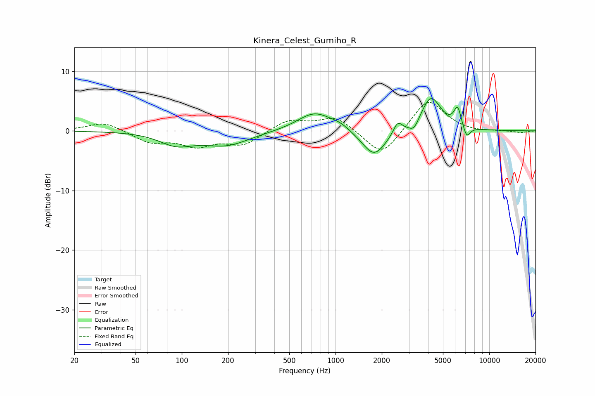

# Kinera_Celest_Gumiho_R
See [usage instructions](https://github.com/jaakkopasanen/AutoEq#usage) for more options and info.

### Parametric EQs
Apply preamp of -5.5 dB when using parametric equalizer.

|   # | Type    |   Fc (Hz) |    Q |   Gain (dB) |
|-----|---------|-----------|------|-------------|
|   1 | Peaking |        92 | 1.31 |        -2   |
|   2 | Peaking |       194 | 0.93 |        -2.3 |
|   3 | Peaking |       733 | 1.25 |         3.2 |
|   4 | Peaking |      1071 | 2.3  |         0.7 |
|   5 | Peaking |      1782 | 1.8  |        -4.5 |
|   6 | Peaking |      2537 | 4.96 |         2   |
|   7 | Peaking |      3238 | 4.55 |        -1.5 |
|   8 | Peaking |      4177 | 2.16 |         5.8 |
|   9 | Peaking |      6230 | 5.81 |         3.3 |
|  10 | Peaking |      7128 | 5.91 |        -2   |

### Fixed Band EQs
When using fixed band (also called graphic) equalizer, apply preamp of **-4.9 dB** (if available) and set gains manually with these parameters.

|   # | Type    |   Fc (Hz) |    Q |   Gain (dB) |
|-----|---------|-----------|------|-------------|
|   1 | Peaking |        31 | 1.41 |         1.5 |
|   2 | Peaking |        62 | 1.41 |        -1.8 |
|   3 | Peaking |       125 | 1.41 |        -2.3 |
|   4 | Peaking |       250 | 1.41 |        -2.3 |
|   5 | Peaking |       500 | 1.41 |         1.9 |
|   6 | Peaking |      1000 | 1.41 |         2.4 |
|   7 | Peaking |      2000 | 1.41 |        -4.5 |
|   8 | Peaking |      4000 | 1.41 |         5.5 |
|   9 | Peaking |      8000 | 1.41 |        -0.3 |
|  10 | Peaking |     16000 | 1.41 |        -0.3 |

### Graphs

