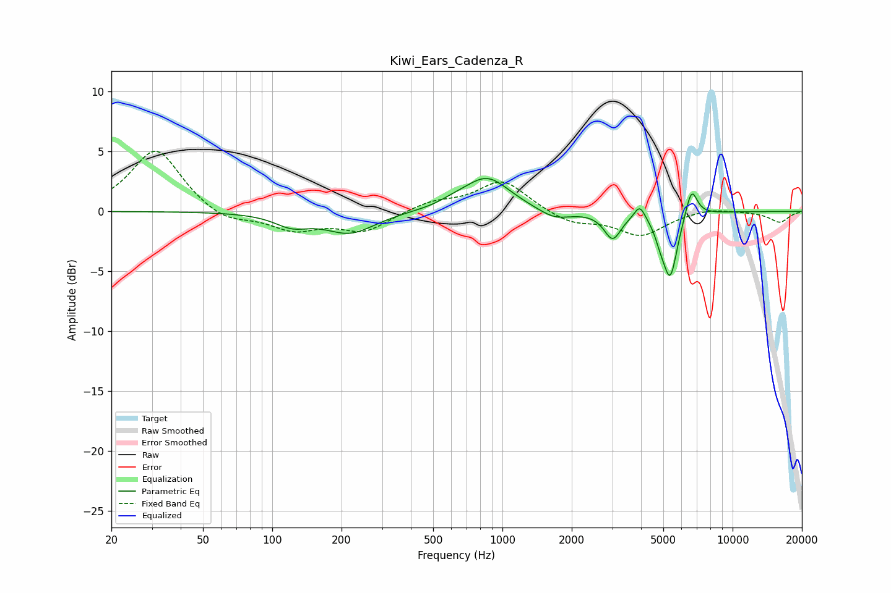

# Kiwi_Ears_Cadenza_R
See [usage instructions](https://github.com/jaakkopasanen/AutoEq#usage) for more options and info.

### Parametric EQs
Apply preamp of -2.8 dB when using parametric equalizer.

|   # | Type    |   Fc (Hz) |    Q |   Gain (dB) |
|-----|---------|-----------|------|-------------|
|   1 | Peaking |       121 | 1.89 |        -1   |
|   2 | Peaking |       218 | 1.29 |        -1.8 |
|   3 | Peaking |       614 | 2.53 |         0.3 |
|   4 | Peaking |       855 | 1.41 |         2.9 |
|   5 | Peaking |      1685 | 1.98 |        -0.8 |
|   6 | Peaking |      3012 | 3.85 |        -2.2 |
|   7 | Peaking |      3949 | 6    |         1.2 |
|   8 | Peaking |      4846 | 6    |        -1   |
|   9 | Peaking |      5357 | 4.43 |        -5.3 |
|  10 | Peaking |      6630 | 5.38 |         2.5 |

### Fixed Band EQs
When using fixed band (also called graphic) equalizer, apply preamp of **-5.1 dB** (if available) and set gains manually with these parameters.

|   # | Type    |   Fc (Hz) |    Q |   Gain (dB) |
|-----|---------|-----------|------|-------------|
|   1 | Peaking |        31 | 1.41 |         5.3 |
|   2 | Peaking |        62 | 1.41 |        -1   |
|   3 | Peaking |       125 | 1.41 |        -1.5 |
|   4 | Peaking |       250 | 1.41 |        -1.6 |
|   5 | Peaking |       500 | 1.41 |         0.8 |
|   6 | Peaking |      1000 | 1.41 |         2.6 |
|   7 | Peaking |      2000 | 1.41 |        -1   |
|   8 | Peaking |      4000 | 1.41 |        -2   |
|   9 | Peaking |      8000 | 1.41 |         0.3 |
|  10 | Peaking |     16000 | 1.41 |        -0.9 |

### Graphs

