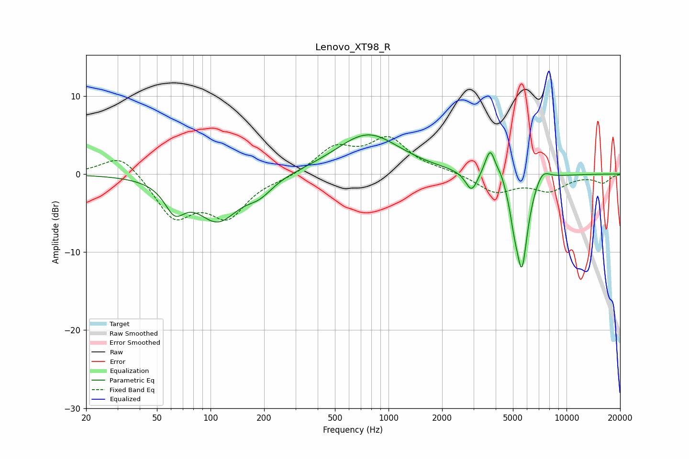

# Lenovo_XT98_R
See [usage instructions](https://github.com/jaakkopasanen/AutoEq#usage) for more options and info.

### Parametric EQs
Apply preamp of -5.1 dB when using parametric equalizer.

|   # | Type    |   Fc (Hz) |    Q |   Gain (dB) |
|-----|---------|-----------|------|-------------|
|   1 | Peaking |        63 | 2.54 |        -3.4 |
|   2 | Peaking |       110 | 1.19 |        -5.7 |
|   3 | Peaking |       189 | 1.89 |        -1.7 |
|   4 | Peaking |       766 | 0.79 |         5.2 |
|   5 | Peaking |      2928 | 4.25 |        -2.6 |
|   6 | Peaking |      3728 | 4.83 |         3.7 |
|   7 | Peaking |      4300 | 5.98 |         0.9 |
|   8 | Peaking |      5081 | 6    |        -2.3 |
|   9 | Peaking |      5610 | 4    |       -11.8 |
|  10 | Peaking |      7292 | 3.2  |         1.7 |

### Fixed Band EQs
When using fixed band (also called graphic) equalizer, apply preamp of **-4.9 dB** (if available) and set gains manually with these parameters.

|   # | Type    |   Fc (Hz) |    Q |   Gain (dB) |
|-----|---------|-----------|------|-------------|
|   1 | Peaking |        31 | 1.41 |         2.8 |
|   2 | Peaking |        62 | 1.41 |        -5.4 |
|   3 | Peaking |       125 | 1.41 |        -5   |
|   4 | Peaking |       250 | 1.41 |        -0.4 |
|   5 | Peaking |       500 | 1.41 |         3.2 |
|   6 | Peaking |      1000 | 1.41 |         4.3 |
|   7 | Peaking |      2000 | 1.41 |         0.4 |
|   8 | Peaking |      4000 | 1.41 |        -2.3 |
|   9 | Peaking |      8000 | 1.41 |        -2   |
|  10 | Peaking |     16000 | 1.41 |        -1.1 |

### Graphs

