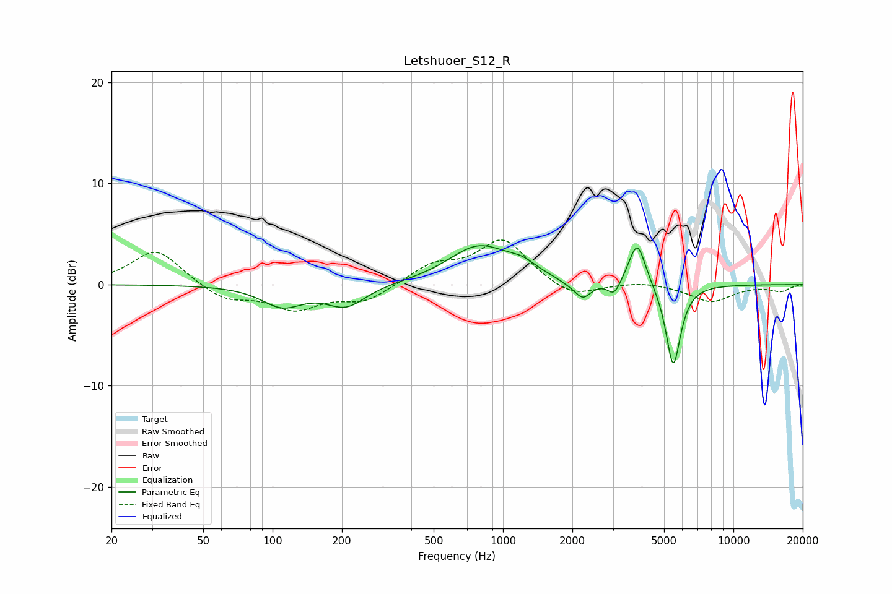

# Letshuoer_S12_R
See [usage instructions](https://github.com/jaakkopasanen/AutoEq#usage) for more options and info.

### Parametric EQs
Apply preamp of -3.9 dB when using parametric equalizer.

|   # | Type    |   Fc (Hz) |    Q |   Gain (dB) |
|-----|---------|-----------|------|-------------|
|   1 | Peaking |       110 | 1.59 |        -2   |
|   2 | Peaking |       208 | 1.67 |        -2.1 |
|   3 | Peaking |       781 | 1.08 |         3.7 |
|   4 | Peaking |      1120 | 1.57 |         0.4 |
|   5 | Peaking |      1226 | 2.48 |         0.7 |
|   6 | Peaking |      1907 | 3.3  |        -0.3 |
|   7 | Peaking |      2220 | 3.99 |        -1.6 |
|   8 | Peaking |      3038 | 5.06 |        -1.5 |
|   9 | Peaking |      3824 | 3.86 |         4.5 |
|  10 | Peaking |      5481 | 4.38 |        -8.2 |

### Fixed Band EQs
When using fixed band (also called graphic) equalizer, apply preamp of **-4.5 dB** (if available) and set gains manually with these parameters.

|   # | Type    |   Fc (Hz) |    Q |   Gain (dB) |
|-----|---------|-----------|------|-------------|
|   1 | Peaking |        31 | 1.41 |         3.5 |
|   2 | Peaking |        62 | 1.41 |        -1.5 |
|   3 | Peaking |       125 | 1.41 |        -2.3 |
|   4 | Peaking |       250 | 1.41 |        -1.6 |
|   5 | Peaking |       500 | 1.41 |         1.8 |
|   6 | Peaking |      1000 | 1.41 |         4.4 |
|   7 | Peaking |      2000 | 1.41 |        -1.4 |
|   8 | Peaking |      4000 | 1.41 |         0.3 |
|   9 | Peaking |      8000 | 1.41 |        -1.7 |
|  10 | Peaking |     16000 | 1.41 |        -0.6 |

### Graphs

