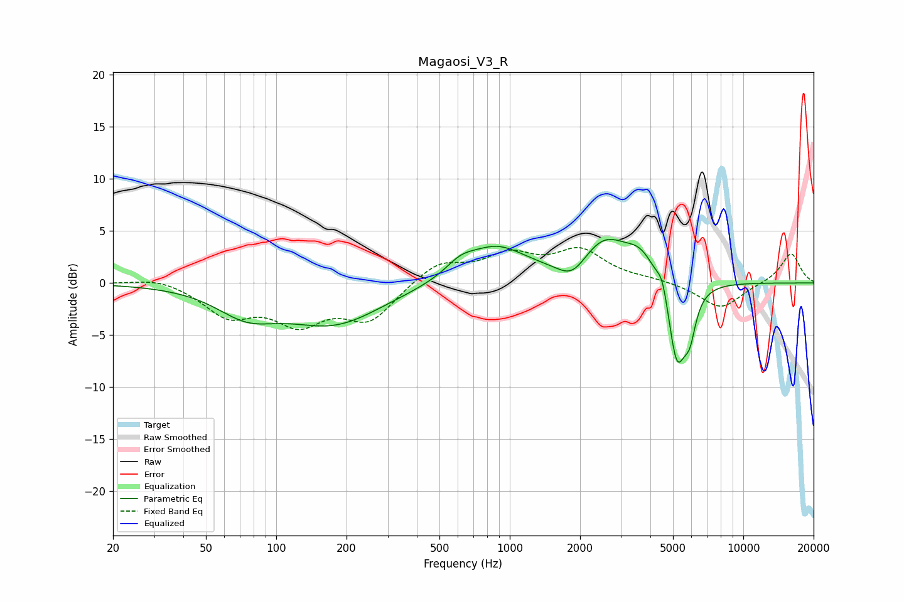

# Magaosi_V3_R
See [usage instructions](https://github.com/jaakkopasanen/AutoEq#usage) for more options and info.

### Parametric EQs
Apply preamp of -4.3 dB when using parametric equalizer.

|   # | Type    |   Fc (Hz) |    Q |   Gain (dB) |
|-----|---------|-----------|------|-------------|
|   1 | Peaking |        75 | 1.09 |        -2.4 |
|   2 | Peaking |       177 | 0.68 |        -3.8 |
|   3 | Peaking |       614 | 2.25 |         1.1 |
|   4 | Peaking |       875 | 1.06 |         3.4 |
|   5 | Peaking |      1857 | 2.24 |        -1.9 |
|   6 | Peaking |      2534 | 1.32 |         4   |
|   7 | Peaking |      3662 | 2.12 |         2.2 |
|   8 | Peaking |      4512 | 5.97 |         1.8 |
|   9 | Peaking |      5198 | 3.49 |        -8.3 |
|  10 | Peaking |      5901 | 5.53 |        -3.1 |

### Fixed Band EQs
When using fixed band (also called graphic) equalizer, apply preamp of **-3.5 dB** (if available) and set gains manually with these parameters.

|   # | Type    |   Fc (Hz) |    Q |   Gain (dB) |
|-----|---------|-----------|------|-------------|
|   1 | Peaking |        31 | 1.41 |         0.6 |
|   2 | Peaking |        62 | 1.41 |        -2.9 |
|   3 | Peaking |       125 | 1.41 |        -3.4 |
|   4 | Peaking |       250 | 1.41 |        -3.4 |
|   5 | Peaking |       500 | 1.41 |         2   |
|   6 | Peaking |      1000 | 1.41 |         2.4 |
|   7 | Peaking |      2000 | 1.41 |         2.9 |
|   8 | Peaking |      4000 | 1.41 |         0.3 |
|   9 | Peaking |      8000 | 1.41 |        -2.5 |
|  10 | Peaking |     16000 | 1.41 |         2.9 |

### Graphs

