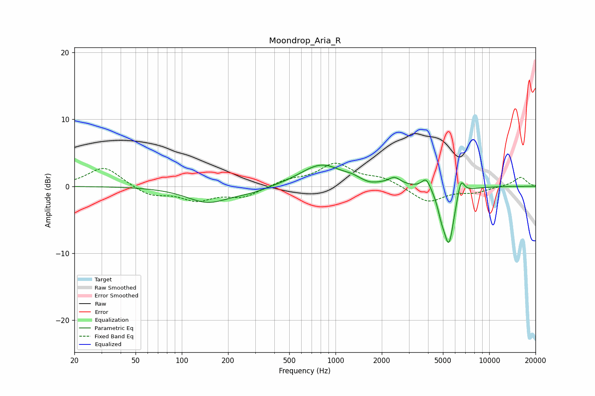

# Moondrop_Aria_R
See [usage instructions](https://github.com/jaakkopasanen/AutoEq#usage) for more options and info.

### Parametric EQs
Apply preamp of -3.3 dB when using parametric equalizer.

|   # | Type    |   Fc (Hz) |    Q |   Gain (dB) |
|-----|---------|-----------|------|-------------|
|   1 | Peaking |       147 | 1.03 |        -2.3 |
|   2 | Peaking |       282 | 1.18 |        -0.7 |
|   3 | Peaking |       810 | 1.04 |         3.3 |
|   4 | Peaking |      1276 | 3.27 |         0.4 |
|   5 | Peaking |      1668 | 3.19 |        -0.3 |
|   6 | Peaking |      2421 | 3.65 |         1.1 |
|   7 | Peaking |      3893 | 4.91 |         1.8 |
|   8 | Peaking |      4890 | 5.59 |        -1.9 |
|   9 | Peaking |      5468 | 4.06 |        -8.3 |
|  10 | Peaking |      6540 | 5.99 |         2.7 |

### Fixed Band EQs
When using fixed band (also called graphic) equalizer, apply preamp of **-3.5 dB** (if available) and set gains manually with these parameters.

|   # | Type    |   Fc (Hz) |    Q |   Gain (dB) |
|-----|---------|-----------|------|-------------|
|   1 | Peaking |        31 | 1.41 |         3   |
|   2 | Peaking |        62 | 1.41 |        -1.4 |
|   3 | Peaking |       125 | 1.41 |        -1.9 |
|   4 | Peaking |       250 | 1.41 |        -1.5 |
|   5 | Peaking |       500 | 1.41 |         0.9 |
|   6 | Peaking |      1000 | 1.41 |         3.2 |
|   7 | Peaking |      2000 | 1.41 |         1.1 |
|   8 | Peaking |      4000 | 1.41 |        -2.4 |
|   9 | Peaking |      8000 | 1.41 |        -0.8 |
|  10 | Peaking |     16000 | 1.41 |         1.4 |

### Graphs

