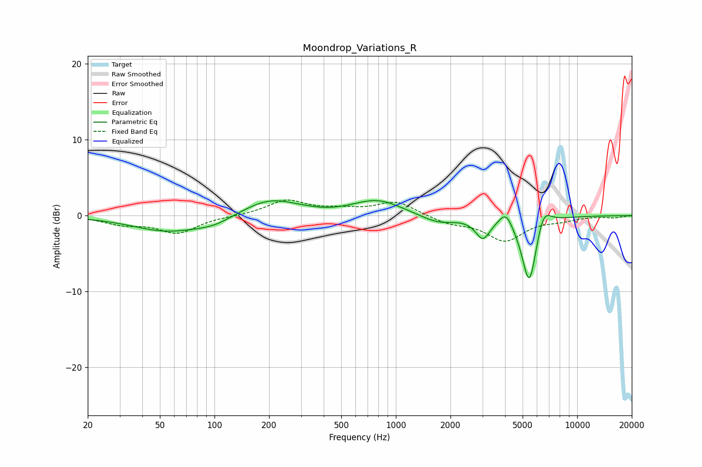

# Moondrop_Variations_R
See [usage instructions](https://github.com/jaakkopasanen/AutoEq#usage) for more options and info.

### Parametric EQs
Apply preamp of -2.1 dB when using parametric equalizer.

|   # | Type    |   Fc (Hz) |    Q |   Gain (dB) |
|-----|---------|-----------|------|-------------|
|   1 | Peaking |        55 | 0.73 |        -2   |
|   2 | Peaking |        99 | 1.33 |        -0.9 |
|   3 | Peaking |       202 | 0.91 |         2.3 |
|   4 | Peaking |       428 | 1.49 |        -0.2 |
|   5 | Peaking |       792 | 1.04 |         2   |
|   6 | Peaking |      1709 | 1.45 |        -1.1 |
|   7 | Peaking |      3020 | 3.54 |        -2.7 |
|   8 | Peaking |      4042 | 3.87 |         1.9 |
|   9 | Peaking |      5446 | 3.28 |        -9.4 |
|  10 | Peaking |      6496 | 3.34 |         2.9 |

### Fixed Band EQs
When using fixed band (also called graphic) equalizer, apply preamp of **-2.1 dB** (if available) and set gains manually with these parameters.

|   # | Type    |   Fc (Hz) |    Q |   Gain (dB) |
|-----|---------|-----------|------|-------------|
|   1 | Peaking |        31 | 1.41 |        -1   |
|   2 | Peaking |        62 | 1.41 |        -2.2 |
|   3 | Peaking |       125 | 1.41 |        -0   |
|   4 | Peaking |       250 | 1.41 |         2   |
|   5 | Peaking |       500 | 1.41 |         0.6 |
|   6 | Peaking |      1000 | 1.41 |         1.8 |
|   7 | Peaking |      2000 | 1.41 |        -0.9 |
|   8 | Peaking |      4000 | 1.41 |        -3.2 |
|   9 | Peaking |      8000 | 1.41 |        -0.5 |
|  10 | Peaking |     16000 | 1.41 |        -0.3 |

### Graphs

