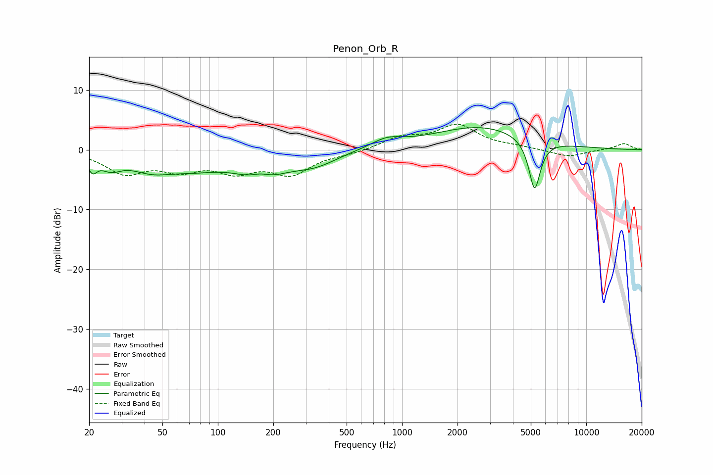

# Penon_Orb_R
See [usage instructions](https://github.com/jaakkopasanen/AutoEq#usage) for more options and info.

### Parametric EQs
Apply preamp of -3.8 dB when using parametric equalizer.

|   # | Type    |   Fc (Hz) |    Q |   Gain (dB) |
|-----|---------|-----------|------|-------------|
|   1 | Peaking |        21 | 5.81 |        -2.3 |
|   2 | Peaking |        26 | 2.44 |        -2.1 |
|   3 | Peaking |        43 | 1.21 |        -2.4 |
|   4 | Peaking |        74 | 0.87 |        -2.2 |
|   5 | Peaking |       170 | 2.5  |         1.5 |
|   6 | Peaking |       172 | 1.14 |        -4.3 |
|   7 | Peaking |       336 | 1.13 |        -2.1 |
|   8 | Peaking |       826 | 1.67 |         1.5 |
|   9 | Peaking |      2667 | 0.54 |         3.9 |
|  10 | Peaking |      5241 | 4.38 |        -8.7 |

### Fixed Band EQs
When using fixed band (also called graphic) equalizer, apply preamp of **-4.4 dB** (if available) and set gains manually with these parameters.

|   # | Type    |   Fc (Hz) |    Q |   Gain (dB) |
|-----|---------|-----------|------|-------------|
|   1 | Peaking |        31 | 1.41 |        -3.6 |
|   2 | Peaking |        62 | 1.41 |        -2.8 |
|   3 | Peaking |       125 | 1.41 |        -3.1 |
|   4 | Peaking |       250 | 1.41 |        -3.7 |
|   5 | Peaking |       500 | 1.41 |        -0.6 |
|   6 | Peaking |      1000 | 1.41 |         1.9 |
|   7 | Peaking |      2000 | 1.41 |         3.9 |
|   8 | Peaking |      4000 | 1.41 |         0.4 |
|   9 | Peaking |      8000 | 1.41 |        -1.2 |
|  10 | Peaking |     16000 | 1.41 |         1.1 |

### Graphs

