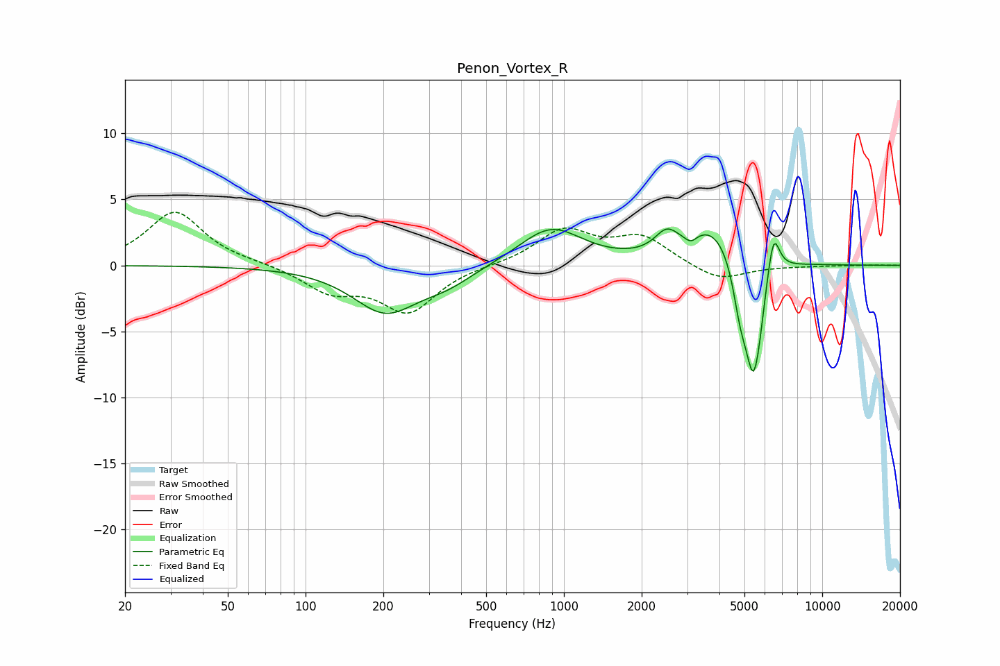

# Penon_Vortex_R
See [usage instructions](https://github.com/jaakkopasanen/AutoEq#usage) for more options and info.

### Parametric EQs
Apply preamp of -2.8 dB when using parametric equalizer.

|   # | Type    |   Fc (Hz) |    Q |   Gain (dB) |
|-----|---------|-----------|------|-------------|
|   1 | Peaking |       204 | 1.13 |        -3.5 |
|   2 | Peaking |       355 | 1.36 |        -1   |
|   3 | Peaking |       890 | 1.16 |         2.9 |
|   4 | Peaking |      2494 | 3.14 |         1.5 |
|   5 | Peaking |      3099 | 6    |        -0.6 |
|   6 | Peaking |      3786 | 1.38 |         3   |
|   7 | Peaking |      4823 | 4.72 |        -3.4 |
|   8 | Peaking |      5408 | 4.46 |        -7.8 |
|   9 | Peaking |      5735 | 6    |        -1.3 |
|  10 | Peaking |      6475 | 5.89 |         3.3 |

### Fixed Band EQs
When using fixed band (also called graphic) equalizer, apply preamp of **-4.1 dB** (if available) and set gains manually with these parameters.

|   # | Type    |   Fc (Hz) |    Q |   Gain (dB) |
|-----|---------|-----------|------|-------------|
|   1 | Peaking |        31 | 1.41 |         4.1 |
|   2 | Peaking |        62 | 1.41 |         0.1 |
|   3 | Peaking |       125 | 1.41 |        -1.8 |
|   4 | Peaking |       250 | 1.41 |        -3.4 |
|   5 | Peaking |       500 | 1.41 |         0   |
|   6 | Peaking |      1000 | 1.41 |         2.6 |
|   7 | Peaking |      2000 | 1.41 |         2.1 |
|   8 | Peaking |      4000 | 1.41 |        -1.2 |
|   9 | Peaking |      8000 | 1.41 |        -0   |
|  10 | Peaking |     16000 | 1.41 |         0   |

### Graphs

