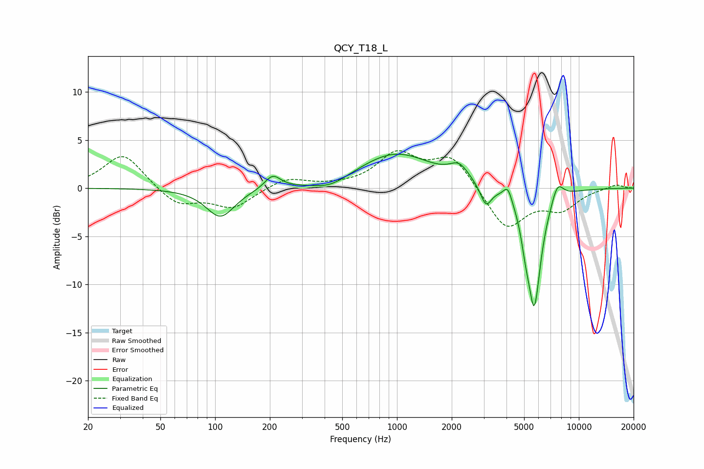

# QCY_T18_L
See [usage instructions](https://github.com/jaakkopasanen/AutoEq#usage) for more options and info.

### Parametric EQs
Apply preamp of -3.6 dB when using parametric equalizer.

|   # | Type    |   Fc (Hz) |    Q |   Gain (dB) |
|-----|---------|-----------|------|-------------|
|   1 | Peaking |       107 | 1.81 |        -3   |
|   2 | Peaking |       207 | 3.25 |         1.4 |
|   3 | Peaking |       430 | 1.47 |        -0.9 |
|   4 | Peaking |       984 | 0.69 |         3.6 |
|   5 | Peaking |      2198 | 2.72 |         1.5 |
|   6 | Peaking |      3084 | 4.6  |        -2.2 |
|   7 | Peaking |      4066 | 6    |         1.5 |
|   8 | Peaking |      5081 | 5.99 |        -1.9 |
|   9 | Peaking |      5684 | 3.59 |       -12.1 |
|  10 | Peaking |      7626 | 4.09 |         1.9 |

### Fixed Band EQs
When using fixed band (also called graphic) equalizer, apply preamp of **-4.0 dB** (if available) and set gains manually with these parameters.

|   # | Type    |   Fc (Hz) |    Q |   Gain (dB) |
|-----|---------|-----------|------|-------------|
|   1 | Peaking |        31 | 1.41 |         3.7 |
|   2 | Peaking |        62 | 1.41 |        -1.9 |
|   3 | Peaking |       125 | 1.41 |        -2   |
|   4 | Peaking |       250 | 1.41 |         1.1 |
|   5 | Peaking |       500 | 1.41 |         0.1 |
|   6 | Peaking |      1000 | 1.41 |         3.4 |
|   7 | Peaking |      2000 | 1.41 |         3.3 |
|   8 | Peaking |      4000 | 1.41 |        -4.3 |
|   9 | Peaking |      8000 | 1.41 |        -2   |
|  10 | Peaking |     16000 | 1.41 |         0.4 |

### Graphs

