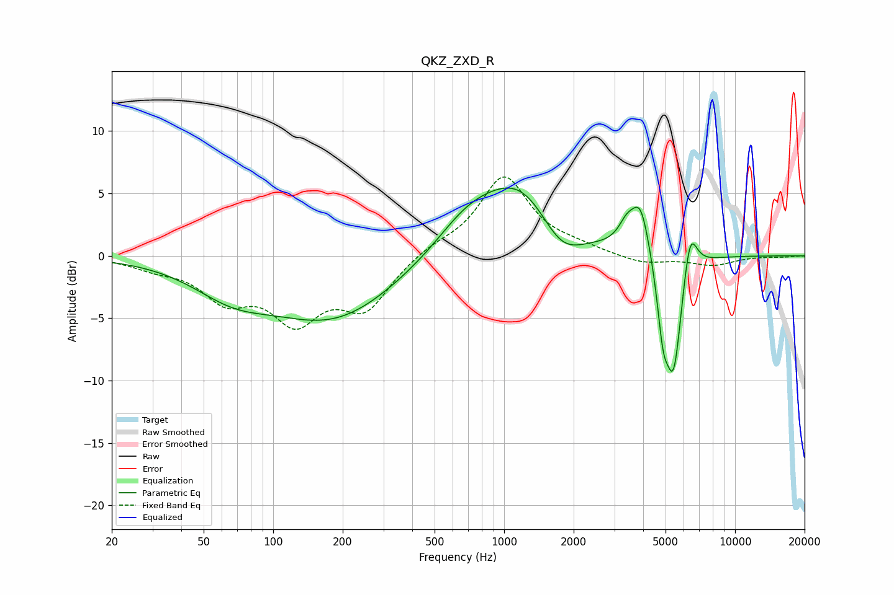

# QKZ_ZXD_R
See [usage instructions](https://github.com/jaakkopasanen/AutoEq#usage) for more options and info.

### Parametric EQs
Apply preamp of -5.5 dB when using parametric equalizer.

|   # | Type    |   Fc (Hz) |    Q |   Gain (dB) |
|-----|---------|-----------|------|-------------|
|   1 | Peaking |        66 | 0.83 |        -2.2 |
|   2 | Peaking |       183 | 0.51 |        -5   |
|   3 | Peaking |       688 | 1.06 |         2.1 |
|   4 | Peaking |      1214 | 0.76 |         6.3 |
|   5 | Peaking |      1754 | 1.37 |        -3.6 |
|   6 | Peaking |      3389 | 4.04 |         1.5 |
|   7 | Peaking |      3900 | 3.5  |         4.1 |
|   8 | Peaking |      4868 | 5.87 |        -4   |
|   9 | Peaking |      5416 | 3.6  |        -9.8 |
|  10 | Peaking |      6373 | 4.47 |         4   |

### Fixed Band EQs
When using fixed band (also called graphic) equalizer, apply preamp of **-6.4 dB** (if available) and set gains manually with these parameters.

|   # | Type    |   Fc (Hz) |    Q |   Gain (dB) |
|-----|---------|-----------|------|-------------|
|   1 | Peaking |        31 | 1.41 |        -0.7 |
|   2 | Peaking |        62 | 1.41 |        -3.1 |
|   3 | Peaking |       125 | 1.41 |        -4.7 |
|   4 | Peaking |       250 | 1.41 |        -3.9 |
|   5 | Peaking |       500 | 1.41 |         0.7 |
|   6 | Peaking |      1000 | 1.41 |         6.3 |
|   7 | Peaking |      2000 | 1.41 |         0.5 |
|   8 | Peaking |      4000 | 1.41 |        -0.7 |
|   9 | Peaking |      8000 | 1.41 |        -0.7 |
|  10 | Peaking |     16000 | 1.41 |        -0.1 |

### Graphs

