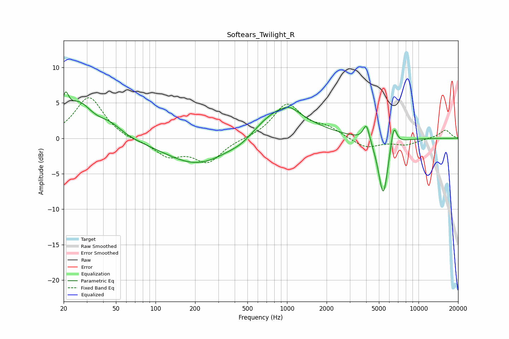

# Softears_Twilight_R
See [usage instructions](https://github.com/jaakkopasanen/AutoEq#usage) for more options and info.

### Parametric EQs
Apply preamp of -6.7 dB when using parametric equalizer.

|   # | Type    |   Fc (Hz) |    Q |   Gain (dB) |
|-----|---------|-----------|------|-------------|
|   1 | Peaking |        21 | 5.74 |         3.2 |
|   2 | Peaking |        26 | 1.37 |         4.6 |
|   3 | Peaking |        45 | 1.55 |         1.5 |
|   4 | Peaking |       213 | 0.58 |        -3.9 |
|   5 | Peaking |       459 | 1.43 |        -0.9 |
|   6 | Peaking |       886 | 0.71 |         4.6 |
|   7 | Peaking |      1055 | 2.69 |         0.6 |
|   8 | Peaking |      4016 | 5.89 |         2.5 |
|   9 | Peaking |      5395 | 3.73 |        -8.4 |
|  10 | Peaking |      6477 | 5.71 |         3.4 |

### Fixed Band EQs
When using fixed band (also called graphic) equalizer, apply preamp of **-5.8 dB** (if available) and set gains manually with these parameters.

|   # | Type    |   Fc (Hz) |    Q |   Gain (dB) |
|-----|---------|-----------|------|-------------|
|   1 | Peaking |        31 | 1.41 |         5.9 |
|   2 | Peaking |        62 | 1.41 |        -0.3 |
|   3 | Peaking |       125 | 1.41 |        -2.3 |
|   4 | Peaking |       250 | 1.41 |        -3.2 |
|   5 | Peaking |       500 | 1.41 |        -0   |
|   6 | Peaking |      1000 | 1.41 |         4.8 |
|   7 | Peaking |      2000 | 1.41 |         1.3 |
|   8 | Peaking |      4000 | 1.41 |        -1.4 |
|   9 | Peaking |      8000 | 1.41 |        -0.9 |
|  10 | Peaking |     16000 | 1.41 |         1.2 |

### Graphs

