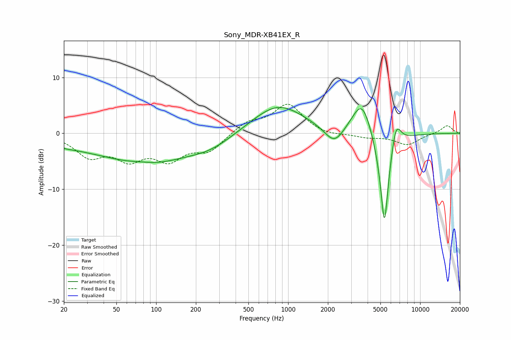

# Sony_MDR-XB41EX_R
See [usage instructions](https://github.com/jaakkopasanen/AutoEq#usage) for more options and info.

### Parametric EQs
Apply preamp of -4.7 dB when using parametric equalizer.

|   # | Type    |   Fc (Hz) |    Q |   Gain (dB) |
|-----|---------|-----------|------|-------------|
|   1 | Peaking |        21 | 2.93 |        -0.3 |
|   2 | Peaking |        24 | 0.61 |        -1.2 |
|   3 | Peaking |        75 | 1.5  |         0.4 |
|   4 | Peaking |        85 | 0.44 |        -5.1 |
|   5 | Peaking |       262 | 0.84 |        -1.7 |
|   6 | Peaking |       837 | 0.71 |         5.2 |
|   7 | Peaking |      2240 | 1.89 |        -3.4 |
|   8 | Peaking |      3636 | 1.79 |         6.9 |
|   9 | Peaking |      5363 | 3.71 |       -18.8 |
|  10 | Peaking |      6562 | 3.61 |         5.1 |

### Fixed Band EQs
When using fixed band (also called graphic) equalizer, apply preamp of **-5.3 dB** (if available) and set gains manually with these parameters.

|   # | Type    |   Fc (Hz) |    Q |   Gain (dB) |
|-----|---------|-----------|------|-------------|
|   1 | Peaking |        31 | 1.41 |        -3.8 |
|   2 | Peaking |        62 | 1.41 |        -4   |
|   3 | Peaking |       125 | 1.41 |        -4.2 |
|   4 | Peaking |       250 | 1.41 |        -3   |
|   5 | Peaking |       500 | 1.41 |         2   |
|   6 | Peaking |      1000 | 1.41 |         5.1 |
|   7 | Peaking |      2000 | 1.41 |        -0.5 |
|   8 | Peaking |      4000 | 1.41 |        -0.7 |
|   9 | Peaking |      8000 | 1.41 |        -2   |
|  10 | Peaking |     16000 | 1.41 |         1.4 |

### Graphs

