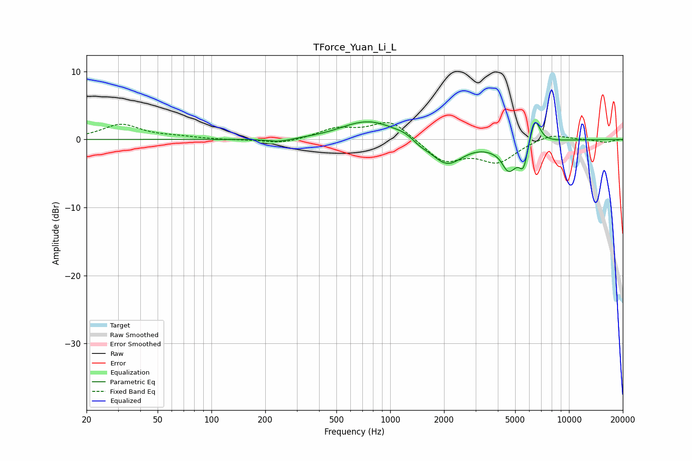

# TForce_Yuan_Li_L
See [usage instructions](https://github.com/jaakkopasanen/AutoEq#usage) for more options and info.

### Parametric EQs
Apply preamp of -2.7 dB when using parametric equalizer.

|   # | Type    |   Fc (Hz) |    Q |   Gain (dB) |
|-----|---------|-----------|------|-------------|
|   1 | Peaking |       240 | 2    |        -0.5 |
|   2 | Peaking |       568 | 1.75 |         0.2 |
|   3 | Peaking |       772 | 1    |         2.7 |
|   4 | Peaking |      1217 | 2.29 |         0.6 |
|   5 | Peaking |      1459 | 3.15 |        -0.6 |
|   6 | Peaking |      2074 | 1.57 |        -3.8 |
|   7 | Peaking |      4206 | 3.69 |         1   |
|   8 | Peaking |      4552 | 2.73 |        -4.9 |
|   9 | Peaking |      5567 | 5.97 |        -3.2 |
|  10 | Peaking |      6448 | 4.71 |         4   |

### Fixed Band EQs
When using fixed band (also called graphic) equalizer, apply preamp of **-2.6 dB** (if available) and set gains manually with these parameters.

|   # | Type    |   Fc (Hz) |    Q |   Gain (dB) |
|-----|---------|-----------|------|-------------|
|   1 | Peaking |        31 | 1.41 |         2.2 |
|   2 | Peaking |        62 | 1.41 |         0.3 |
|   3 | Peaking |       125 | 1.41 |        -0.1 |
|   4 | Peaking |       250 | 1.41 |        -0.7 |
|   5 | Peaking |       500 | 1.41 |         1.5 |
|   6 | Peaking |      1000 | 1.41 |         2.9 |
|   7 | Peaking |      2000 | 1.41 |        -3.2 |
|   8 | Peaking |      4000 | 1.41 |        -3.1 |
|   9 | Peaking |      8000 | 1.41 |         1   |
|  10 | Peaking |     16000 | 1.41 |        -0.4 |

### Graphs

