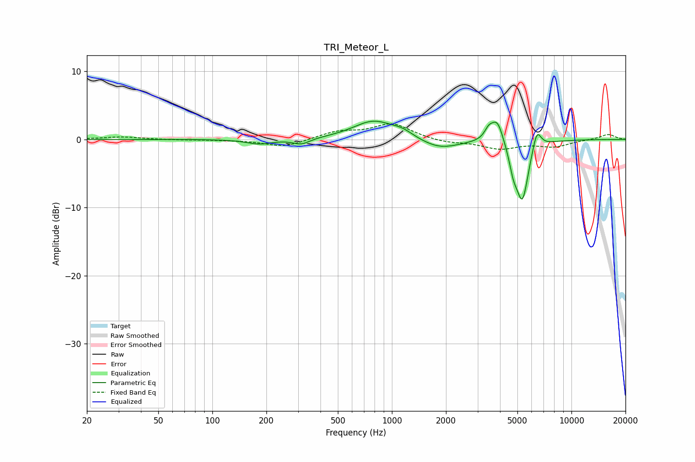

# TRI_Meteor_L
See [usage instructions](https://github.com/jaakkopasanen/AutoEq#usage) for more options and info.

### Parametric EQs
Apply preamp of -2.8 dB when using parametric equalizer.

|   # | Type    |   Fc (Hz) |    Q |   Gain (dB) |
|-----|---------|-----------|------|-------------|
|   1 | Peaking |       183 | 1.97 |        -0.7 |
|   2 | Peaking |       313 | 2.96 |        -0.9 |
|   3 | Peaking |       791 | 1.24 |         2.7 |
|   4 | Peaking |      1145 | 2.39 |         0.8 |
|   5 | Peaking |      1846 | 1.29 |        -1.5 |
|   6 | Peaking |      3461 | 6    |         1.3 |
|   7 | Peaking |      3863 | 4.13 |         3.4 |
|   8 | Peaking |      4748 | 5.98 |        -2.6 |
|   9 | Peaking |      5327 | 3.98 |        -8.7 |
|  10 | Peaking |      6413 | 5.76 |         3   |

### Fixed Band EQs
When using fixed band (also called graphic) equalizer, apply preamp of **-2.4 dB** (if available) and set gains manually with these parameters.

|   # | Type    |   Fc (Hz) |    Q |   Gain (dB) |
|-----|---------|-----------|------|-------------|
|   1 | Peaking |        31 | 1.41 |         0.4 |
|   2 | Peaking |        62 | 1.41 |        -0.1 |
|   3 | Peaking |       125 | 1.41 |        -0.1 |
|   4 | Peaking |       250 | 1.41 |        -1.1 |
|   5 | Peaking |       500 | 1.41 |         1.1 |
|   6 | Peaking |      1000 | 1.41 |         2.3 |
|   7 | Peaking |      2000 | 1.41 |        -0.5 |
|   8 | Peaking |      4000 | 1.41 |        -1.3 |
|   9 | Peaking |      8000 | 1.41 |        -1   |
|  10 | Peaking |     16000 | 1.41 |         0.8 |

### Graphs

