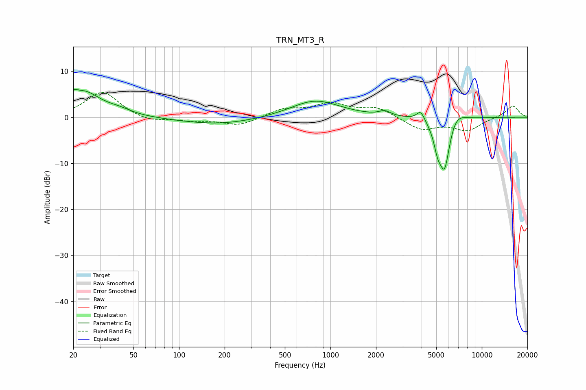

# TRN_MT3_R
See [usage instructions](https://github.com/jaakkopasanen/AutoEq#usage) for more options and info.

### Parametric EQs
Apply preamp of -6.1 dB when using parametric equalizer.

|   # | Type    |   Fc (Hz) |    Q |   Gain (dB) |
|-----|---------|-----------|------|-------------|
|   1 | Peaking |        20 | 5.77 |         1.2 |
|   2 | Peaking |        23 | 1.26 |         5.4 |
|   3 | Peaking |        40 | 1.77 |         0.9 |
|   4 | Peaking |       184 | 0.54 |        -1.6 |
|   5 | Peaking |       792 | 0.87 |         3.8 |
|   6 | Peaking |      2288 | 3.92 |         1   |
|   7 | Peaking |      3947 | 5.24 |         2.3 |
|   8 | Peaking |      5109 | 5.74 |        -3.5 |
|   9 | Peaking |      5676 | 3.55 |       -11.9 |
|  10 | Peaking |      6649 | 2.36 |         3.1 |

### Fixed Band EQs
When using fixed band (also called graphic) equalizer, apply preamp of **-5.5 dB** (if available) and set gains manually with these parameters.

|   # | Type    |   Fc (Hz) |    Q |   Gain (dB) |
|-----|---------|-----------|------|-------------|
|   1 | Peaking |        31 | 1.41 |         5.6 |
|   2 | Peaking |        62 | 1.41 |        -1.1 |
|   3 | Peaking |       125 | 1.41 |        -0.7 |
|   4 | Peaking |       250 | 1.41 |        -1.8 |
|   5 | Peaking |       500 | 1.41 |         1.7 |
|   6 | Peaking |      1000 | 1.41 |         2.7 |
|   7 | Peaking |      2000 | 1.41 |         2.1 |
|   8 | Peaking |      4000 | 1.41 |        -2.7 |
|   9 | Peaking |      8000 | 1.41 |        -2.7 |
|  10 | Peaking |     16000 | 1.41 |         2.6 |

### Graphs

