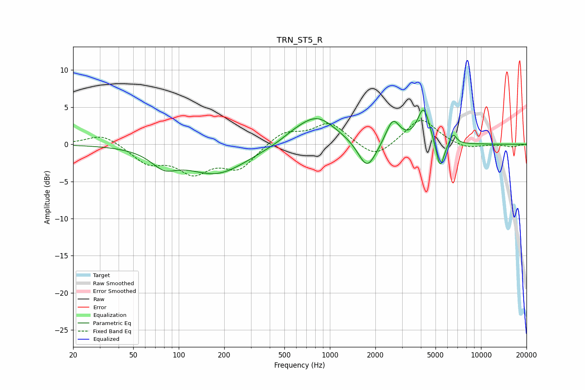

# TRN_ST5_R
See [usage instructions](https://github.com/jaakkopasanen/AutoEq#usage) for more options and info.

### Parametric EQs
Apply preamp of -4.7 dB when using parametric equalizer.

|   # | Type    |   Fc (Hz) |    Q |   Gain (dB) |
|-----|---------|-----------|------|-------------|
|   1 | Peaking |        80 | 1.69 |        -2   |
|   2 | Peaking |       178 | 0.69 |        -3.9 |
|   3 | Peaking |       570 | 1.71 |         0.5 |
|   4 | Peaking |       817 | 1.09 |         3.8 |
|   5 | Peaking |      1753 | 2.48 |        -3.3 |
|   6 | Peaking |      1892 | 2.02 |        -0.6 |
|   7 | Peaking |      2610 | 3.09 |         3.3 |
|   8 | Peaking |      4174 | 3.48 |         4.8 |
|   9 | Peaking |      5361 | 5.14 |        -4   |
|  10 | Peaking |      6535 | 6    |         1.4 |

### Fixed Band EQs
When using fixed band (also called graphic) equalizer, apply preamp of **-3.3 dB** (if available) and set gains manually with these parameters.

|   # | Type    |   Fc (Hz) |    Q |   Gain (dB) |
|-----|---------|-----------|------|-------------|
|   1 | Peaking |        31 | 1.41 |         1.5 |
|   2 | Peaking |        62 | 1.41 |        -2.3 |
|   3 | Peaking |       125 | 1.41 |        -3.4 |
|   4 | Peaking |       250 | 1.41 |        -3.1 |
|   5 | Peaking |       500 | 1.41 |         1.8 |
|   6 | Peaking |      1000 | 1.41 |         2.9 |
|   7 | Peaking |      2000 | 1.41 |        -2.1 |
|   8 | Peaking |      4000 | 1.41 |         3.6 |
|   9 | Peaking |      8000 | 1.41 |        -0.7 |
|  10 | Peaking |     16000 | 1.41 |        -0.3 |

### Graphs

