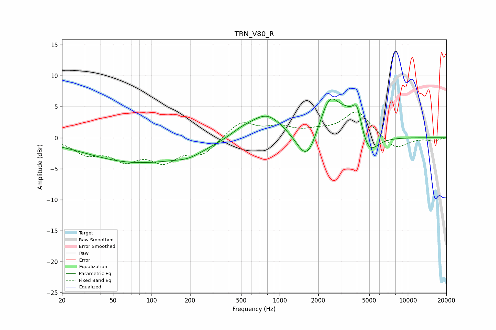

# TRN_V80_R
See [usage instructions](https://github.com/jaakkopasanen/AutoEq#usage) for more options and info.

### Parametric EQs
Apply preamp of -6.4 dB when using parametric equalizer.

|   # | Type    |   Fc (Hz) |    Q |   Gain (dB) |
|-----|---------|-----------|------|-------------|
|   1 | Peaking |        27 | 0.71 |         0.2 |
|   2 | Peaking |        78 | 0.32 |        -4   |
|   3 | Peaking |       196 | 1.43 |        -0.8 |
|   4 | Peaking |       500 | 1.45 |         0.9 |
|   5 | Peaking |       794 | 1.1  |         3.8 |
|   6 | Peaking |      1631 | 1.81 |        -5.2 |
|   7 | Peaking |      2453 | 1.78 |         6.5 |
|   8 | Peaking |      3303 | 2.1  |         2.1 |
|   9 | Peaking |      4009 | 3.75 |         4.4 |
|  10 | Peaking |      4948 | 2.02 |        -3.5 |

### Fixed Band EQs
When using fixed band (also called graphic) equalizer, apply preamp of **-4.2 dB** (if available) and set gains manually with these parameters.

|   # | Type    |   Fc (Hz) |    Q |   Gain (dB) |
|-----|---------|-----------|------|-------------|
|   1 | Peaking |        31 | 1.41 |        -2.3 |
|   2 | Peaking |        62 | 1.41 |        -3.1 |
|   3 | Peaking |       125 | 1.41 |        -3.3 |
|   4 | Peaking |       250 | 1.41 |        -2.4 |
|   5 | Peaking |       500 | 1.41 |         2.6 |
|   6 | Peaking |      1000 | 1.41 |         1.5 |
|   7 | Peaking |      2000 | 1.41 |         0.8 |
|   8 | Peaking |      4000 | 1.41 |         4.2 |
|   9 | Peaking |      8000 | 1.41 |        -2   |
|  10 | Peaking |     16000 | 1.41 |        -0.5 |

### Graphs

