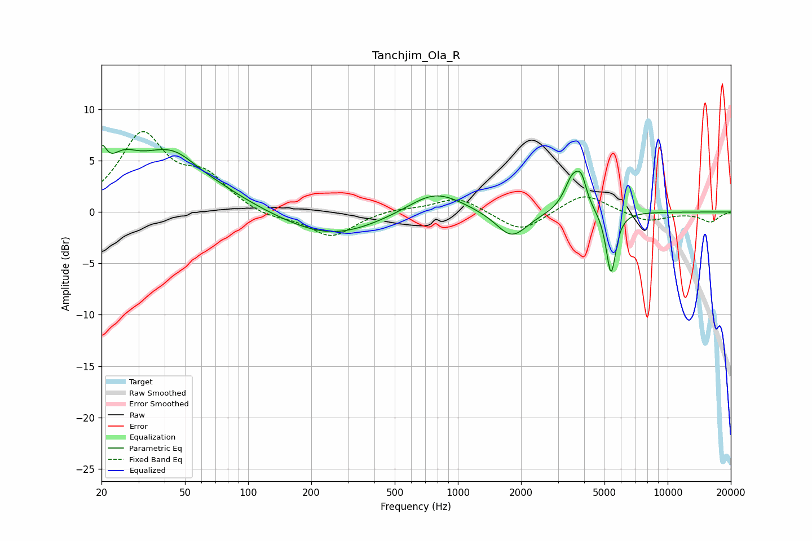

# Tanchjim_Ola_R
See [usage instructions](https://github.com/jaakkopasanen/AutoEq#usage) for more options and info.

### Parametric EQs
Apply preamp of -6.6 dB when using parametric equalizer.

|   # | Type    |   Fc (Hz) |    Q |   Gain (dB) |
|-----|---------|-----------|------|-------------|
|   1 | Peaking |        20 | 5.96 |         2.9 |
|   2 | Peaking |        25 | 2    |         2.4 |
|   3 | Peaking |        44 | 0.75 |         6.1 |
|   4 | Peaking |        58 | 1.59 |        -0.7 |
|   5 | Peaking |       247 | 0.61 |        -2.5 |
|   6 | Peaking |       780 | 1.07 |         2.3 |
|   7 | Peaking |      1807 | 1.89 |        -2.6 |
|   8 | Peaking |      3529 | 3.51 |         3.3 |
|   9 | Peaking |      3887 | 5.84 |         2   |
|  10 | Peaking |      5373 | 6    |        -6.2 |

### Fixed Band EQs
When using fixed band (also called graphic) equalizer, apply preamp of **-7.9 dB** (if available) and set gains manually with these parameters.

|   # | Type    |   Fc (Hz) |    Q |   Gain (dB) |
|-----|---------|-----------|------|-------------|
|   1 | Peaking |        31 | 1.41 |         7.3 |
|   2 | Peaking |        62 | 1.41 |         3   |
|   3 | Peaking |       125 | 1.41 |        -0.7 |
|   4 | Peaking |       250 | 1.41 |        -2.4 |
|   5 | Peaking |       500 | 1.41 |         0.3 |
|   6 | Peaking |      1000 | 1.41 |         1.5 |
|   7 | Peaking |      2000 | 1.41 |        -2   |
|   8 | Peaking |      4000 | 1.41 |         1.9 |
|   9 | Peaking |      8000 | 1.41 |        -1   |
|  10 | Peaking |     16000 | 1.41 |        -1   |

### Graphs

