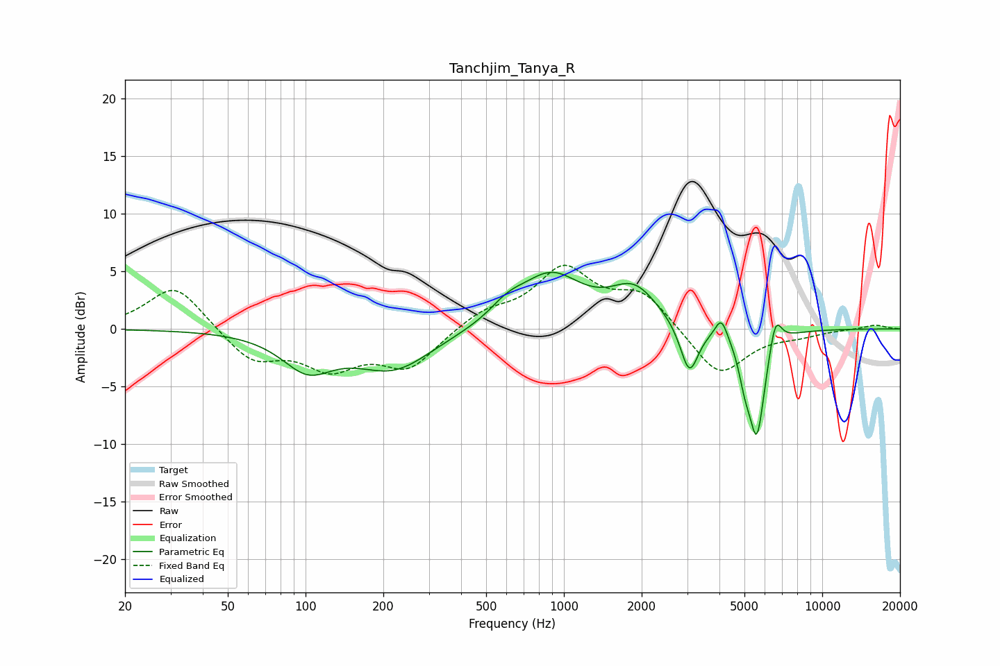

# Tanchjim_Tanya_R
See [usage instructions](https://github.com/jaakkopasanen/AutoEq#usage) for more options and info.

### Parametric EQs
Apply preamp of -5.0 dB when using parametric equalizer.

|   # | Type    |   Fc (Hz) |    Q |   Gain (dB) |
|-----|---------|-----------|------|-------------|
|   1 | Peaking |       102 | 1.44 |        -3.1 |
|   2 | Peaking |       219 | 0.94 |        -3.4 |
|   3 | Peaking |       604 | 2.05 |         1.2 |
|   4 | Peaking |       891 | 1.17 |         4.4 |
|   5 | Peaking |      1872 | 1.52 |         3.2 |
|   6 | Peaking |      3059 | 4.02 |        -4.4 |
|   7 | Peaking |      4069 | 5.98 |         1.8 |
|   8 | Peaking |      5013 | 6    |        -2.2 |
|   9 | Peaking |      5585 | 4.3  |        -9.1 |
|  10 | Peaking |      6588 | 5.77 |         2.8 |

### Fixed Band EQs
When using fixed band (also called graphic) equalizer, apply preamp of **-5.6 dB** (if available) and set gains manually with these parameters.

|   # | Type    |   Fc (Hz) |    Q |   Gain (dB) |
|-----|---------|-----------|------|-------------|
|   1 | Peaking |        31 | 1.41 |         3.9 |
|   2 | Peaking |        62 | 1.41 |        -2.8 |
|   3 | Peaking |       125 | 1.41 |        -3   |
|   4 | Peaking |       250 | 1.41 |        -3.3 |
|   5 | Peaking |       500 | 1.41 |         1.4 |
|   6 | Peaking |      1000 | 1.41 |         5   |
|   7 | Peaking |      2000 | 1.41 |         3   |
|   8 | Peaking |      4000 | 1.41 |        -4.2 |
|   9 | Peaking |      8000 | 1.41 |        -0.5 |
|  10 | Peaking |     16000 | 1.41 |         0.4 |

### Graphs

