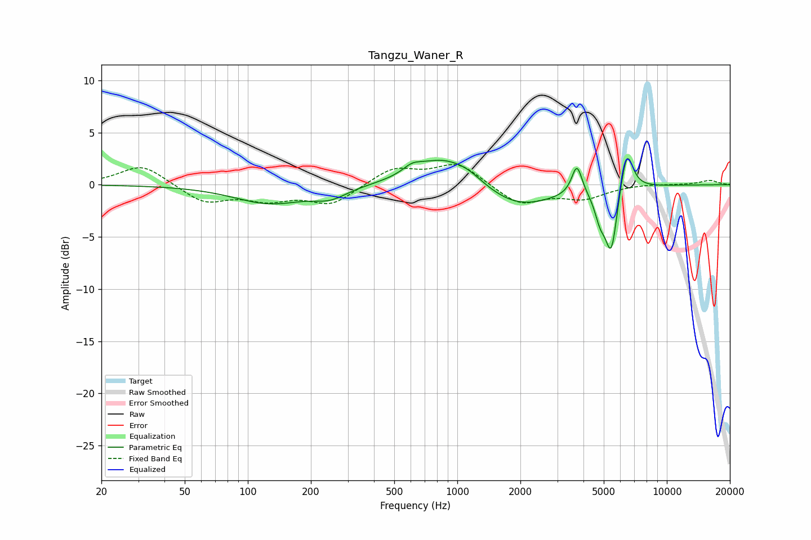

# Tangzu_Waner_R
See [usage instructions](https://github.com/jaakkopasanen/AutoEq#usage) for more options and info.

### Parametric EQs
Apply preamp of -2.6 dB when using parametric equalizer.

|   # | Type    |   Fc (Hz) |    Q |   Gain (dB) |
|-----|---------|-----------|------|-------------|
|   1 | Peaking |       127 | 0.83 |        -1.8 |
|   2 | Peaking |       247 | 1.76 |        -1   |
|   3 | Peaking |       609 | 3.18 |         0.7 |
|   4 | Peaking |       851 | 1.02 |         2.7 |
|   5 | Peaking |      1129 | 1.97 |         0.6 |
|   6 | Peaking |      1949 | 0.83 |        -2.3 |
|   7 | Peaking |      3723 | 5.75 |         2.9 |
|   8 | Peaking |      4805 | 5.37 |        -2.1 |
|   9 | Peaking |      5429 | 4.8  |        -6.1 |
|  10 | Peaking |      6436 | 4.58 |         4.2 |

### Fixed Band EQs
When using fixed band (also called graphic) equalizer, apply preamp of **-2.0 dB** (if available) and set gains manually with these parameters.

|   # | Type    |   Fc (Hz) |    Q |   Gain (dB) |
|-----|---------|-----------|------|-------------|
|   1 | Peaking |        31 | 1.41 |         2   |
|   2 | Peaking |        62 | 1.41 |        -1.7 |
|   3 | Peaking |       125 | 1.41 |        -1.3 |
|   4 | Peaking |       250 | 1.41 |        -1.8 |
|   5 | Peaking |       500 | 1.41 |         1.6 |
|   6 | Peaking |      1000 | 1.41 |         2.1 |
|   7 | Peaking |      2000 | 1.41 |        -1.9 |
|   8 | Peaking |      4000 | 1.41 |        -1.2 |
|   9 | Peaking |      8000 | 1.41 |         0.1 |
|  10 | Peaking |     16000 | 1.41 |         0.4 |

### Graphs

