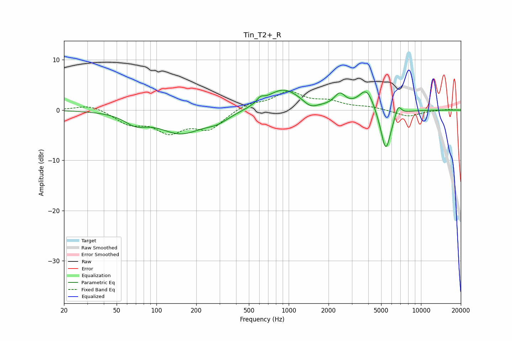

# Tin_T2+_R
See [usage instructions](https://github.com/jaakkopasanen/AutoEq#usage) for more options and info.

### Parametric EQs
Apply preamp of -4.1 dB when using parametric equalizer.

|   # | Type    |   Fc (Hz) |    Q |   Gain (dB) |
|-----|---------|-----------|------|-------------|
|   1 | Peaking |        69 | 1.74 |        -1.9 |
|   2 | Peaking |       153 | 0.84 |        -4.4 |
|   3 | Peaking |       290 | 1.6  |        -1.4 |
|   4 | Peaking |       610 | 5.12 |         1   |
|   5 | Peaking |       912 | 1.09 |         4.2 |
|   6 | Peaking |      1460 | 2.78 |        -1.2 |
|   7 | Peaking |      2433 | 3.43 |         2.5 |
|   8 | Peaking |      3882 | 2.41 |         4.4 |
|   9 | Peaking |      5417 | 3.45 |        -8.8 |
|  10 | Peaking |      6723 | 5.8  |         2.2 |

### Fixed Band EQs
When using fixed band (also called graphic) equalizer, apply preamp of **-3.9 dB** (if available) and set gains manually with these parameters.

|   # | Type    |   Fc (Hz) |    Q |   Gain (dB) |
|-----|---------|-----------|------|-------------|
|   1 | Peaking |        31 | 1.41 |         1.2 |
|   2 | Peaking |        62 | 1.41 |        -2.5 |
|   3 | Peaking |       125 | 1.41 |        -3.9 |
|   4 | Peaking |       250 | 1.41 |        -3.5 |
|   5 | Peaking |       500 | 1.41 |         1.3 |
|   6 | Peaking |      1000 | 1.41 |         3.4 |
|   7 | Peaking |      2000 | 1.41 |         1.4 |
|   8 | Peaking |      4000 | 1.41 |         0.5 |
|   9 | Peaking |      8000 | 1.41 |        -1.3 |
|  10 | Peaking |     16000 | 1.41 |         0.1 |

### Graphs

