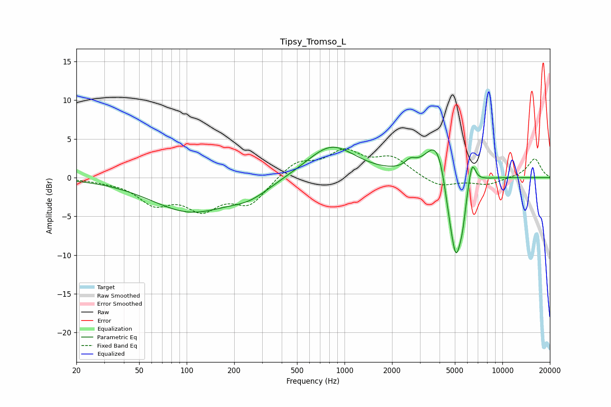

# Tipsy_Tromso_L
See [usage instructions](https://github.com/jaakkopasanen/AutoEq#usage) for more options and info.

### Parametric EQs
Apply preamp of -4.0 dB when using parametric equalizer.

|   # | Type    |   Fc (Hz) |    Q |   Gain (dB) |
|-----|---------|-----------|------|-------------|
|   1 | Peaking |       105 | 0.57 |        -4.3 |
|   2 | Peaking |       252 | 1.08 |        -1.6 |
|   3 | Peaking |       824 | 0.91 |         4.2 |
|   4 | Peaking |      2615 | 4.35 |         0.9 |
|   5 | Peaking |      3698 | 1.67 |         1.5 |
|   6 | Peaking |      3950 | 2.07 |         4.4 |
|   7 | Peaking |      4591 | 3.6  |        -3.6 |
|   8 | Peaking |      5084 | 3.83 |        -9.4 |
|   9 | Peaking |      5580 | 6    |        -2.9 |
|  10 | Peaking |      6411 | 5.87 |         3.3 |

### Fixed Band EQs
When using fixed band (also called graphic) equalizer, apply preamp of **-3.8 dB** (if available) and set gains manually with these parameters.

|   # | Type    |   Fc (Hz) |    Q |   Gain (dB) |
|-----|---------|-----------|------|-------------|
|   1 | Peaking |        31 | 1.41 |        -0.3 |
|   2 | Peaking |        62 | 1.41 |        -3   |
|   3 | Peaking |       125 | 1.41 |        -3.6 |
|   4 | Peaking |       250 | 1.41 |        -3.2 |
|   5 | Peaking |       500 | 1.41 |         2   |
|   6 | Peaking |      1000 | 1.41 |         3.1 |
|   7 | Peaking |      2000 | 1.41 |         2.4 |
|   8 | Peaking |      4000 | 1.41 |        -1.3 |
|   9 | Peaking |      8000 | 1.41 |        -0.9 |
|  10 | Peaking |     16000 | 1.41 |         2.5 |

### Graphs

