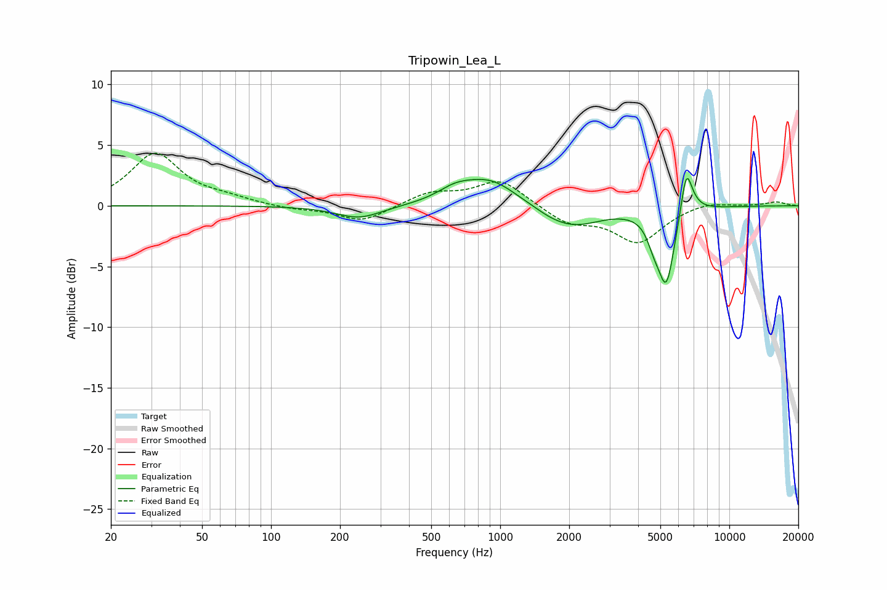

# Tripowin_Lea_L
See [usage instructions](https://github.com/jaakkopasanen/AutoEq#usage) for more options and info.

### Parametric EQs
Apply preamp of -2.3 dB when using parametric equalizer.

|   # | Type    |   Fc (Hz) |    Q |   Gain (dB) |
|-----|---------|-----------|------|-------------|
|   1 | Peaking |       242 | 1.41 |        -1.1 |
|   2 | Peaking |       619 | 1.91 |         0.7 |
|   3 | Peaking |       681 | 2.06 |         0.2 |
|   4 | Peaking |       905 | 1.19 |         2.2 |
|   5 | Peaking |      1651 | 2.08 |        -0.2 |
|   6 | Peaking |      2070 | 1.12 |        -1.7 |
|   7 | Peaking |      4669 | 5.02 |        -1.3 |
|   8 | Peaking |      5308 | 3.69 |        -6.3 |
|   9 | Peaking |      6486 | 5.77 |         3.3 |
|  10 | Peaking |      6711 | 3.27 |         0.8 |

### Fixed Band EQs
When using fixed band (also called graphic) equalizer, apply preamp of **-4.4 dB** (if available) and set gains manually with these parameters.

|   # | Type    |   Fc (Hz) |    Q |   Gain (dB) |
|-----|---------|-----------|------|-------------|
|   1 | Peaking |        31 | 1.41 |         4.3 |
|   2 | Peaking |        62 | 1.41 |         0.5 |
|   3 | Peaking |       125 | 1.41 |        -0.3 |
|   4 | Peaking |       250 | 1.41 |        -1.3 |
|   5 | Peaking |       500 | 1.41 |         1   |
|   6 | Peaking |      1000 | 1.41 |         2.1 |
|   7 | Peaking |      2000 | 1.41 |        -1.4 |
|   8 | Peaking |      4000 | 1.41 |        -2.9 |
|   9 | Peaking |      8000 | 1.41 |         0.4 |
|  10 | Peaking |     16000 | 1.41 |         0.3 |

### Graphs

