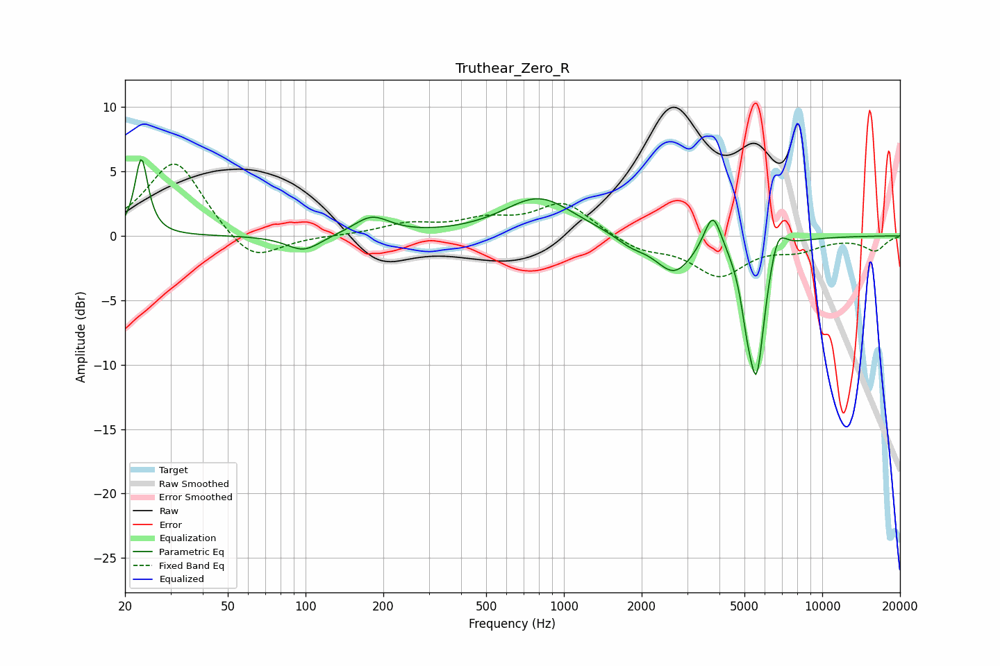

# Truthear_Zero_R
See [usage instructions](https://github.com/jaakkopasanen/AutoEq#usage) for more options and info.

### Parametric EQs
Apply preamp of -6.0 dB when using parametric equalizer.

|   # | Type    |   Fc (Hz) |    Q |   Gain (dB) |
|-----|---------|-----------|------|-------------|
|   1 | Peaking |        23 | 5.88 |         6   |
|   2 | Peaking |        98 | 2.13 |        -1.3 |
|   3 | Peaking |       180 | 2.02 |         1.4 |
|   4 | Peaking |       800 | 1.05 |         3   |
|   5 | Peaking |      1815 | 2.39 |        -0.7 |
|   6 | Peaking |      2671 | 1.9  |        -2.8 |
|   7 | Peaking |      3770 | 4.23 |         3.1 |
|   8 | Peaking |      5106 | 6    |        -2.3 |
|   9 | Peaking |      5569 | 4.19 |       -10.3 |
|  10 | Peaking |      6719 | 4.19 |         2.2 |

### Fixed Band EQs
When using fixed band (also called graphic) equalizer, apply preamp of **-5.7 dB** (if available) and set gains manually with these parameters.

|   # | Type    |   Fc (Hz) |    Q |   Gain (dB) |
|-----|---------|-----------|------|-------------|
|   1 | Peaking |        31 | 1.41 |         6   |
|   2 | Peaking |        62 | 1.41 |        -2.4 |
|   3 | Peaking |       125 | 1.41 |        -0   |
|   4 | Peaking |       250 | 1.41 |         0.8 |
|   5 | Peaking |       500 | 1.41 |         1   |
|   6 | Peaking |      1000 | 1.41 |         2.6 |
|   7 | Peaking |      2000 | 1.41 |        -1   |
|   8 | Peaking |      4000 | 1.41 |        -2.9 |
|   9 | Peaking |      8000 | 1.41 |        -0.9 |
|  10 | Peaking |     16000 | 1.41 |        -1.1 |

### Graphs

