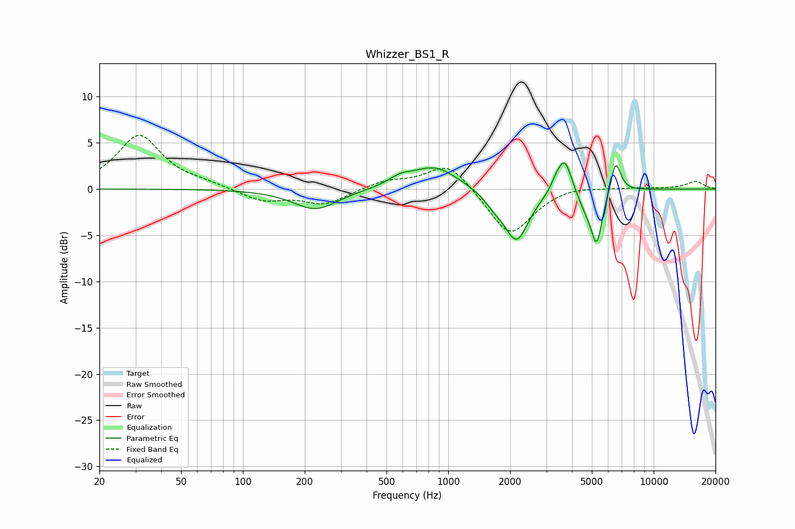

# Whizzer_BS1_R
See [usage instructions](https://github.com/jaakkopasanen/AutoEq#usage) for more options and info.

### Parametric EQs
Apply preamp of -2.9 dB when using parametric equalizer.

|   # | Type    |   Fc (Hz) |    Q |   Gain (dB) |
|-----|---------|-----------|------|-------------|
|   1 | Peaking |       226 | 1.3  |        -2.3 |
|   2 | Peaking |       583 | 2.49 |         0.8 |
|   3 | Peaking |       858 | 1.24 |         2.5 |
|   4 | Peaking |      1676 | 2.76 |        -1.1 |
|   5 | Peaking |      2153 | 2.37 |        -5.5 |
|   6 | Peaking |      3334 | 5.99 |         0.8 |
|   7 | Peaking |      3688 | 4.12 |         3.8 |
|   8 | Peaking |      4673 | 3.34 |        -1.6 |
|   9 | Peaking |      5281 | 4.97 |        -5.4 |
|  10 | Peaking |      6535 | 5.48 |         3.5 |

### Fixed Band EQs
When using fixed band (also called graphic) equalizer, apply preamp of **-5.9 dB** (if available) and set gains manually with these parameters.

|   # | Type    |   Fc (Hz) |    Q |   Gain (dB) |
|-----|---------|-----------|------|-------------|
|   1 | Peaking |        31 | 1.41 |         5.8 |
|   2 | Peaking |        62 | 1.41 |         0.4 |
|   3 | Peaking |       125 | 1.41 |        -1.3 |
|   4 | Peaking |       250 | 1.41 |        -1.6 |
|   5 | Peaking |       500 | 1.41 |         0.9 |
|   6 | Peaking |      1000 | 1.41 |         3   |
|   7 | Peaking |      2000 | 1.41 |        -5.2 |
|   8 | Peaking |      4000 | 1.41 |         0.5 |
|   9 | Peaking |      8000 | 1.41 |         0.1 |
|  10 | Peaking |     16000 | 1.41 |         0.8 |

### Graphs

