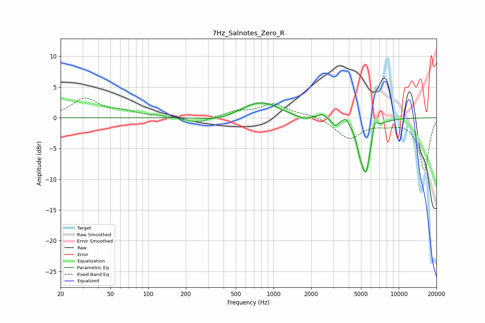

# 7Hz_Salnotes_Zero_R
See [usage instructions](https://github.com/jaakkopasanen/AutoEq#usage) for more options and info.

### Parametric EQs
Apply preamp of -2.5 dB when using parametric equalizer.

|   # | Type    |   Fc (Hz) |    Q |   Gain (dB) |
|-----|---------|-----------|------|-------------|
|   1 | Peaking |       351 | 1.2  |        -0.6 |
|   2 | Peaking |       762 | 1.04 |         2.4 |
|   3 | Peaking |       985 | 2.74 |         0.3 |
|   4 | Peaking |      1736 | 3.13 |        -0.5 |
|   5 | Peaking |      2456 | 4.59 |         0.7 |
|   6 | Peaking |      3093 | 6    |        -1.1 |
|   7 | Peaking |      3771 | 6    |         0.9 |
|   8 | Peaking |      4866 | 5.84 |        -1.8 |
|   9 | Peaking |      5460 | 3.47 |        -8.7 |
|  10 | Peaking |      6432 | 6    |         2.4 |

### Fixed Band EQs
When using fixed band (also called graphic) equalizer, apply preamp of **-3.3 dB** (if available) and set gains manually with these parameters.

|   # | Type    |   Fc (Hz) |    Q |   Gain (dB) |
|-----|---------|-----------|------|-------------|
|   1 | Peaking |        31 | 1.41 |         3   |
|   2 | Peaking |        62 | 1.41 |         0.8 |
|   3 | Peaking |       125 | 1.41 |         0.2 |
|   4 | Peaking |       250 | 1.41 |        -0.9 |
|   5 | Peaking |       500 | 1.41 |         0.9 |
|   6 | Peaking |      1000 | 1.41 |         2.2 |
|   7 | Peaking |      2000 | 1.41 |         0.5 |
|   8 | Peaking |      4000 | 1.41 |        -3.3 |
|   9 | Peaking |      8000 | 1.41 |        -0.7 |
|  10 | Peaking |     16000 | 1.41 |        -8.5 |

### Graphs

