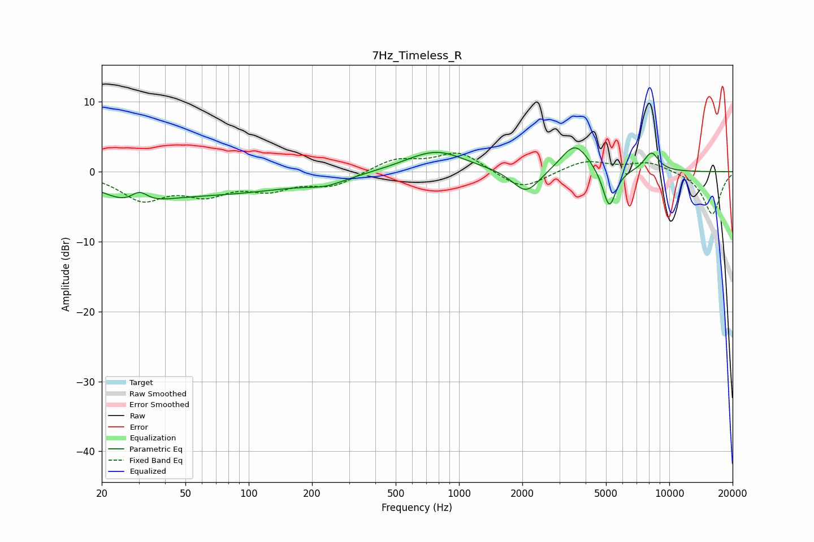

# 7Hz_Timeless_R
See [usage instructions](https://github.com/jaakkopasanen/AutoEq#usage) for more options and info.

### Parametric EQs
Apply preamp of -3.5 dB when using parametric equalizer.

|   # | Type    |   Fc (Hz) |    Q |   Gain (dB) |
|-----|---------|-----------|------|-------------|
|   1 | Peaking |        28 | 1.07 |        -3.1 |
|   2 | Peaking |        30 | 3.39 |         1.9 |
|   3 | Peaking |        73 | 0.37 |        -2.9 |
|   4 | Peaking |       233 | 1.55 |        -1   |
|   5 | Peaking |       610 | 0.98 |         0.4 |
|   6 | Peaking |       791 | 1.05 |         2.7 |
|   7 | Peaking |      2087 | 2.16 |        -3.5 |
|   8 | Peaking |      3562 | 2.09 |         4.2 |
|   9 | Peaking |      5184 | 4.41 |        -5.8 |
|  10 | Peaking |      8220 | 3.62 |         2.7 |

### Fixed Band EQs
When using fixed band (also called graphic) equalizer, apply preamp of **-2.8 dB** (if available) and set gains manually with these parameters.

|   # | Type    |   Fc (Hz) |    Q |   Gain (dB) |
|-----|---------|-----------|------|-------------|
|   1 | Peaking |        31 | 1.41 |        -3.7 |
|   2 | Peaking |        62 | 1.41 |        -2.8 |
|   3 | Peaking |       125 | 1.41 |        -2.2 |
|   4 | Peaking |       250 | 1.41 |        -1.9 |
|   5 | Peaking |       500 | 1.41 |         1.8 |
|   6 | Peaking |      1000 | 1.41 |         2.8 |
|   7 | Peaking |      2000 | 1.41 |        -2.7 |
|   8 | Peaking |      4000 | 1.41 |         1.6 |
|   9 | Peaking |      8000 | 1.41 |         1.4 |
|  10 | Peaking |     16000 | 1.41 |        -6.1 |

### Graphs

