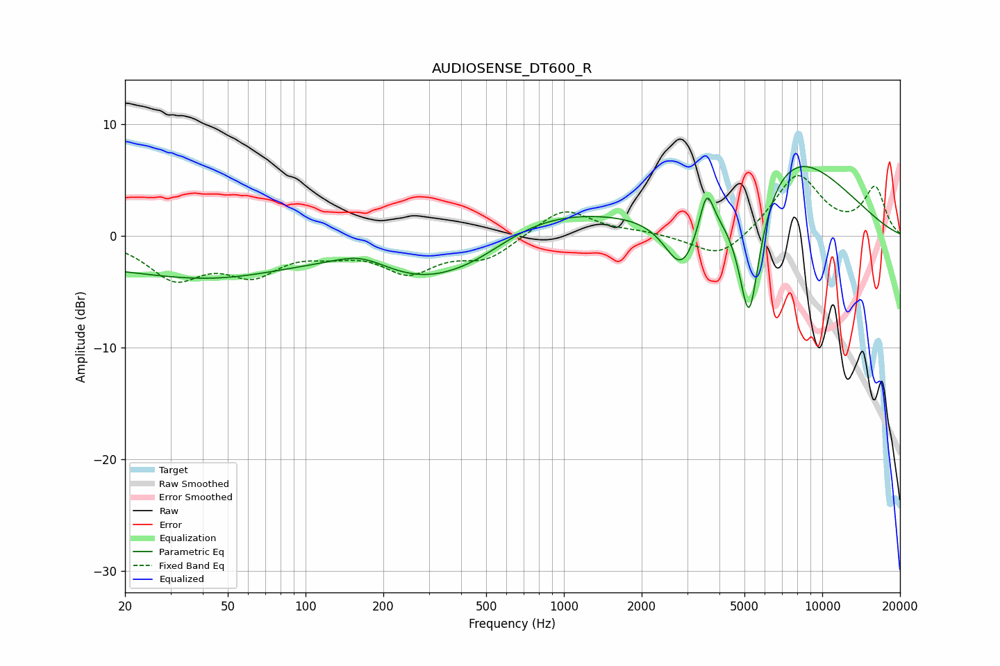

# AUDIOSENSE_DT600_R
See [usage instructions](https://github.com/jaakkopasanen/AutoEq#usage) for more options and info.

### Parametric EQs
Apply preamp of -6.3 dB when using parametric equalizer.

|   # | Type    |   Fc (Hz) |    Q |   Gain (dB) |
|-----|---------|-----------|------|-------------|
|   1 | Peaking |        20 | 0.18 |        -2.4 |
|   2 | Peaking |        44 | 0.54 |        -1.4 |
|   3 | Peaking |       164 | 1.38 |         1.2 |
|   4 | Peaking |       293 | 0.63 |        -3.9 |
|   5 | Peaking |       470 | 0.96 |        -1.2 |
|   6 | Peaking |       798 | 0.48 |         2.6 |
|   7 | Peaking |      2864 | 2.04 |        -5.5 |
|   8 | Peaking |      3569 | 5.32 |         3.6 |
|   9 | Peaking |      5212 | 2.99 |       -13   |
|  10 | Peaking |      7074 | 0.53 |         8   |

### Fixed Band EQs
When using fixed band (also called graphic) equalizer, apply preamp of **-5.5 dB** (if available) and set gains manually with these parameters.

|   # | Type    |   Fc (Hz) |    Q |   Gain (dB) |
|-----|---------|-----------|------|-------------|
|   1 | Peaking |        31 | 1.41 |        -3.5 |
|   2 | Peaking |        62 | 1.41 |        -3   |
|   3 | Peaking |       125 | 1.41 |        -1   |
|   4 | Peaking |       250 | 1.41 |        -3   |
|   5 | Peaking |       500 | 1.41 |        -1.9 |
|   6 | Peaking |      1000 | 1.41 |         2.6 |
|   7 | Peaking |      2000 | 1.41 |         0.3 |
|   8 | Peaking |      4000 | 1.41 |        -2.3 |
|   9 | Peaking |      8000 | 1.41 |         5.5 |
|  10 | Peaking |     16000 | 1.41 |         4.2 |

### Graphs

