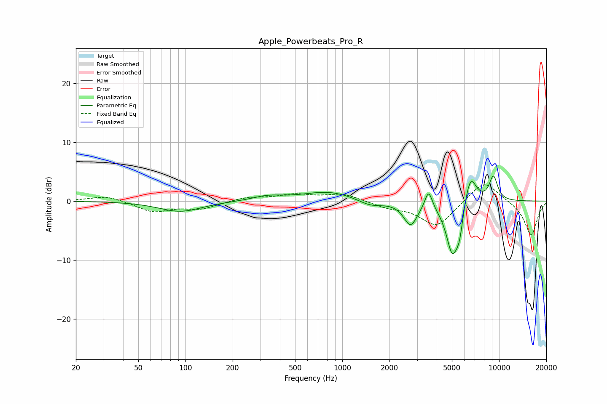

# Apple_Powerbeats_Pro_R
See [usage instructions](https://github.com/jaakkopasanen/AutoEq#usage) for more options and info.

### Parametric EQs
Apply preamp of -4.3 dB when using parametric equalizer.

|   # | Type    |   Fc (Hz) |    Q |   Gain (dB) |
|-----|---------|-----------|------|-------------|
|   1 | Peaking |        93 | 1.05 |        -1.8 |
|   2 | Peaking |       333 | 1.53 |         0.7 |
|   3 | Peaking |       825 | 0.84 |         1.6 |
|   4 | Peaking |      1514 | 1.72 |        -1.1 |
|   5 | Peaking |      2726 | 3.29 |        -3.9 |
|   6 | Peaking |      3551 | 5.92 |         3.2 |
|   7 | Peaking |      5032 | 3.41 |        -8.8 |
|   8 | Peaking |      5591 | 6    |        -3.6 |
|   9 | Peaking |      6544 | 3.48 |         5.4 |
|  10 | Peaking |      9196 | 4.68 |         4.2 |

### Fixed Band EQs
When using fixed band (also called graphic) equalizer, apply preamp of **-2.8 dB** (if available) and set gains manually with these parameters.

|   # | Type    |   Fc (Hz) |    Q |   Gain (dB) |
|-----|---------|-----------|------|-------------|
|   1 | Peaking |        31 | 1.41 |         1   |
|   2 | Peaking |        62 | 1.41 |        -1.8 |
|   3 | Peaking |       125 | 1.41 |        -1.2 |
|   4 | Peaking |       250 | 1.41 |         0.6 |
|   5 | Peaking |       500 | 1.41 |         1   |
|   6 | Peaking |      1000 | 1.41 |         1.2 |
|   7 | Peaking |      2000 | 1.41 |        -0.9 |
|   8 | Peaking |      4000 | 1.41 |        -4.3 |
|   9 | Peaking |      8000 | 1.41 |         3.7 |
|  10 | Peaking |     16000 | 1.41 |        -5.8 |

### Graphs

