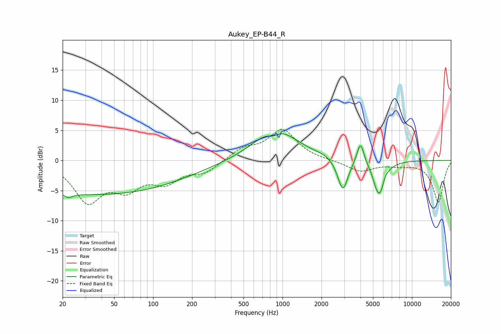

# Aukey_EP-B44_R
See [usage instructions](https://github.com/jaakkopasanen/AutoEq#usage) for more options and info.

### Parametric EQs
Apply preamp of -4.5 dB when using parametric equalizer.

|   # | Type    |   Fc (Hz) |    Q |   Gain (dB) |
|-----|---------|-----------|------|-------------|
|   1 | Peaking |        22 | 4.85 |        -0.7 |
|   2 | Peaking |        35 | 0.18 |        -5.7 |
|   3 | Peaking |       853 | 3.06 |        -1   |
|   4 | Peaking |       882 | 0.87 |         5.5 |
|   5 | Peaking |      2101 | 2.37 |         0.3 |
|   6 | Peaking |      2927 | 3.6  |        -5.4 |
|   7 | Peaking |      4001 | 5.19 |         3.7 |
|   8 | Peaking |      5354 | 4.37 |        -1.5 |
|   9 | Peaking |      5720 | 3.27 |        -5.2 |
|  10 | Peaking |      6121 | 4.79 |         1.4 |

### Fixed Band EQs
When using fixed band (also called graphic) equalizer, apply preamp of **-5.2 dB** (if available) and set gains manually with these parameters.

|   # | Type    |   Fc (Hz) |    Q |   Gain (dB) |
|-----|---------|-----------|------|-------------|
|   1 | Peaking |        31 | 1.41 |        -6.5 |
|   2 | Peaking |        62 | 1.41 |        -3.9 |
|   3 | Peaking |       125 | 1.41 |        -3.1 |
|   4 | Peaking |       250 | 1.41 |        -1.8 |
|   5 | Peaking |       500 | 1.41 |         1.8 |
|   6 | Peaking |      1000 | 1.41 |         5   |
|   7 | Peaking |      2000 | 1.41 |        -0   |
|   8 | Peaking |      4000 | 1.41 |        -1.8 |
|   9 | Peaking |      8000 | 1.41 |        -0.6 |
|  10 | Peaking |     16000 | 1.41 |        -6.9 |

### Graphs

