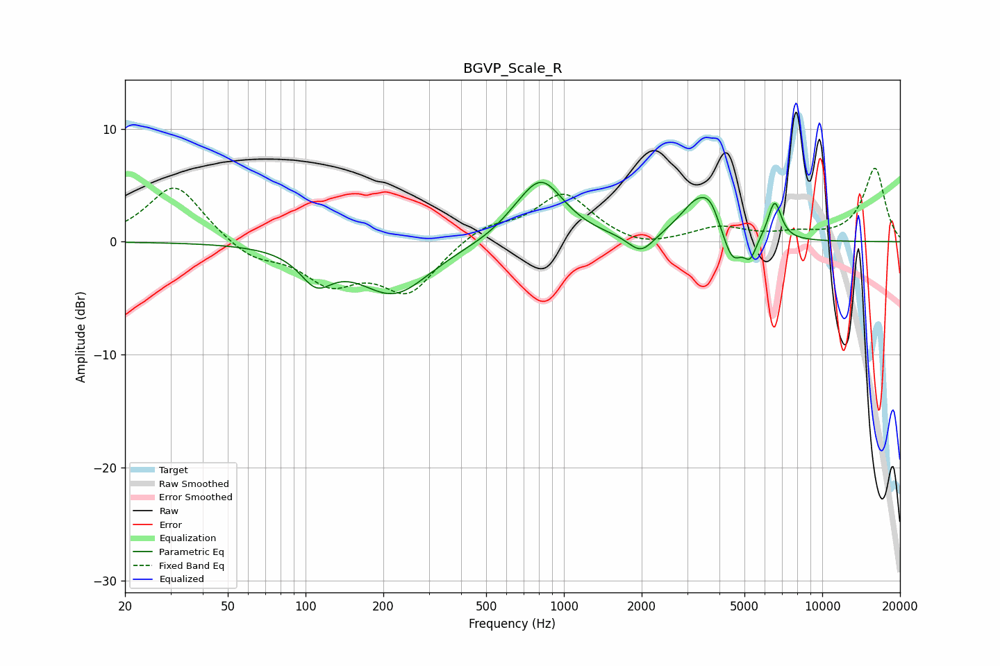

# BGVP_Scale_R
See [usage instructions](https://github.com/jaakkopasanen/AutoEq#usage) for more options and info.

### Parametric EQs
Apply preamp of -5.4 dB when using parametric equalizer.

|   # | Type    |   Fc (Hz) |    Q |   Gain (dB) |
|-----|---------|-----------|------|-------------|
|   1 | Peaking |       110 | 2.28 |        -2.7 |
|   2 | Peaking |       220 | 1.01 |        -4.6 |
|   3 | Peaking |       635 | 2.26 |         0.3 |
|   4 | Peaking |       815 | 1.55 |         5.5 |
|   5 | Peaking |      1989 | 2.85 |        -1.7 |
|   6 | Peaking |      3339 | 1.94 |         3.8 |
|   7 | Peaking |      3709 | 4.45 |         1.2 |
|   8 | Peaking |      4484 | 3.64 |        -2.9 |
|   9 | Peaking |      5265 | 5.97 |        -1.7 |
|  10 | Peaking |      6544 | 5.36 |         3.5 |

### Fixed Band EQs
When using fixed band (also called graphic) equalizer, apply preamp of **-6.6 dB** (if available) and set gains manually with these parameters.

|   # | Type    |   Fc (Hz) |    Q |   Gain (dB) |
|-----|---------|-----------|------|-------------|
|   1 | Peaking |        31 | 1.41 |         5.2 |
|   2 | Peaking |        62 | 1.41 |        -1.5 |
|   3 | Peaking |       125 | 1.41 |        -3.3 |
|   4 | Peaking |       250 | 1.41 |        -4.3 |
|   5 | Peaking |       500 | 1.41 |         1.4 |
|   6 | Peaking |      1000 | 1.41 |         4.2 |
|   7 | Peaking |      2000 | 1.41 |        -0.7 |
|   8 | Peaking |      4000 | 1.41 |         1.2 |
|   9 | Peaking |      8000 | 1.41 |         0.6 |
|  10 | Peaking |     16000 | 1.41 |         6.5 |

### Graphs

