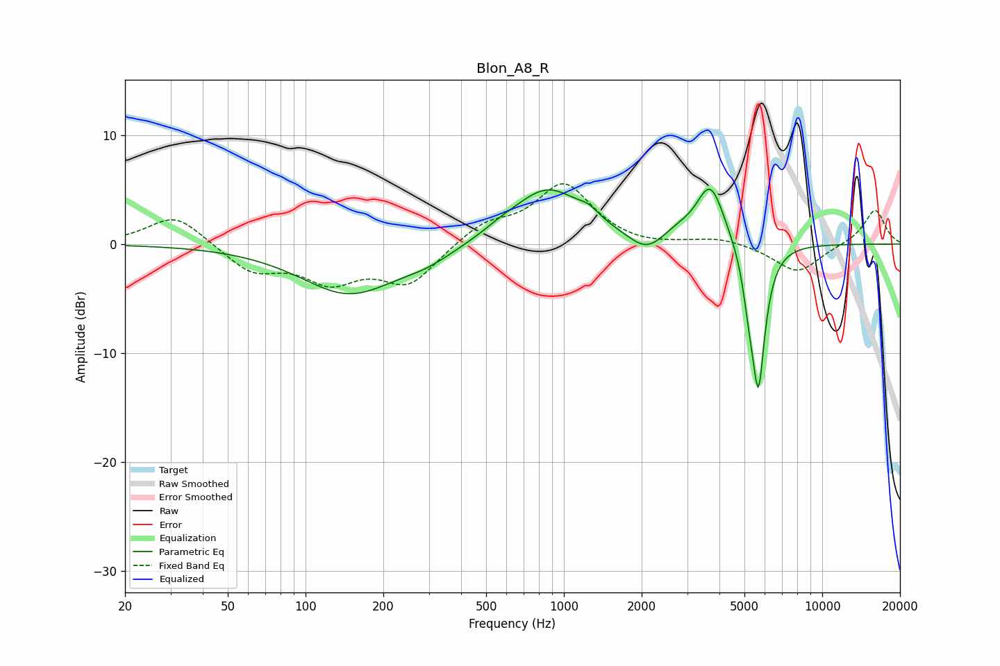

# Blon_A8_R
See [usage instructions](https://github.com/jaakkopasanen/AutoEq#usage) for more options and info.

### Parametric EQs
Apply preamp of -5.1 dB when using parametric equalizer.

|   # | Type    |   Fc (Hz) |    Q |   Gain (dB) |
|-----|---------|-----------|------|-------------|
|   1 | Peaking |       148 | 0.75 |        -4.5 |
|   2 | Peaking |       296 | 1.35 |        -0.9 |
|   3 | Peaking |       571 | 2.06 |         0.4 |
|   4 | Peaking |       863 | 1.03 |         5.1 |
|   5 | Peaking |      1248 | 3.48 |         0.8 |
|   6 | Peaking |      2076 | 2.16 |        -1.6 |
|   7 | Peaking |      2744 | 2.8  |         0.6 |
|   8 | Peaking |      3688 | 2.54 |         5.6 |
|   9 | Peaking |      5211 | 5.99 |        -2.9 |
|  10 | Peaking |      5663 | 5.25 |       -12.8 |

### Fixed Band EQs
When using fixed band (also called graphic) equalizer, apply preamp of **-5.6 dB** (if available) and set gains manually with these parameters.

|   # | Type    |   Fc (Hz) |    Q |   Gain (dB) |
|-----|---------|-----------|------|-------------|
|   1 | Peaking |        31 | 1.41 |         2.8 |
|   2 | Peaking |        62 | 1.41 |        -2.4 |
|   3 | Peaking |       125 | 1.41 |        -3.1 |
|   4 | Peaking |       250 | 1.41 |        -3.6 |
|   5 | Peaking |       500 | 1.41 |         1.8 |
|   6 | Peaking |      1000 | 1.41 |         5.4 |
|   7 | Peaking |      2000 | 1.41 |        -0.3 |
|   8 | Peaking |      4000 | 1.41 |         0.6 |
|   9 | Peaking |      8000 | 1.41 |        -2.7 |
|  10 | Peaking |     16000 | 1.41 |         3.2 |

### Graphs

