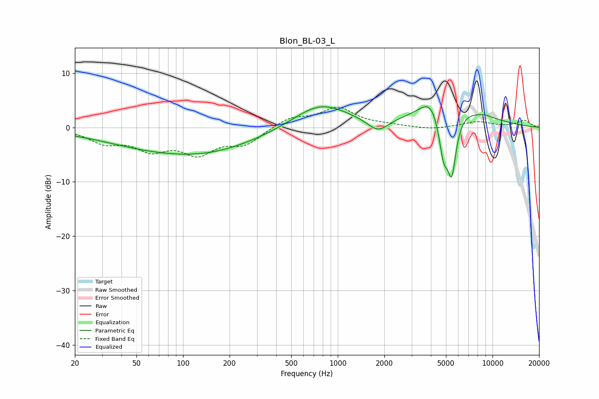

# Blon_BL-03_L
See [usage instructions](https://github.com/jaakkopasanen/AutoEq#usage) for more options and info.

### Parametric EQs
Apply preamp of -3.9 dB when using parametric equalizer.

|   # | Type    |   Fc (Hz) |    Q |   Gain (dB) |
|-----|---------|-----------|------|-------------|
|   1 | Peaking |        31 | 0.38 |        -0.3 |
|   2 | Peaking |       108 | 0.31 |        -4.7 |
|   3 | Peaking |       145 | 0.79 |        -0.3 |
|   4 | Peaking |       769 | 0.79 |         4.6 |
|   5 | Peaking |      1820 | 2.1  |        -2.5 |
|   6 | Peaking |      3982 | 2.14 |         3   |
|   7 | Peaking |      4826 | 4.42 |        -7.7 |
|   8 | Peaking |      5458 | 4.69 |       -10.7 |
|   9 | Peaking |      5532 | 0.61 |         3.8 |
|  10 | Peaking |      9005 | 4.12 |         0.2 |

### Fixed Band EQs
When using fixed band (also called graphic) equalizer, apply preamp of **-3.8 dB** (if available) and set gains manually with these parameters.

|   # | Type    |   Fc (Hz) |    Q |   Gain (dB) |
|-----|---------|-----------|------|-------------|
|   1 | Peaking |        31 | 1.41 |        -2.5 |
|   2 | Peaking |        62 | 1.41 |        -3.5 |
|   3 | Peaking |       125 | 1.41 |        -4.3 |
|   4 | Peaking |       250 | 1.41 |        -2.8 |
|   5 | Peaking |       500 | 1.41 |         1.8 |
|   6 | Peaking |      1000 | 1.41 |         3.5 |
|   7 | Peaking |      2000 | 1.41 |         0.3 |
|   8 | Peaking |      4000 | 1.41 |        -0.4 |
|   9 | Peaking |      8000 | 1.41 |         1   |
|  10 | Peaking |     16000 | 1.41 |         1.3 |

### Graphs

